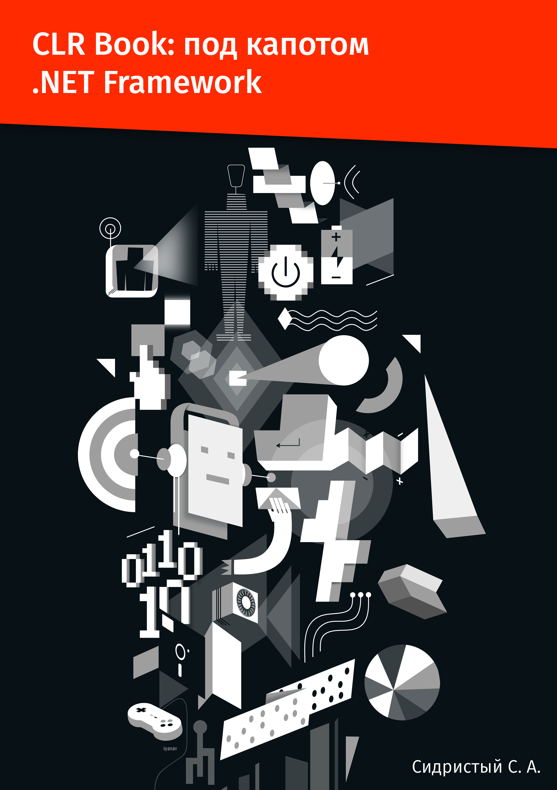

# This book is available in:

  - **English**: If you want to show that you like this book or to express your gratitude to author, Star this project, Fork it and Pull Requests to it.
  - **Русском**: Если вы хотите показать, что книга вам нравится или выразить благодарность, ставьте звезду проекту, делайте fork и создавайте Pull Requests!
  - **中文**: 如果你想表明你喜欢这本书或者表达你对作者的感激之情，请Star、Fork、PR一条龙。

Cover | From Author, Stanislav Sidristij
-------|-----
 | <h3>Introduction</h3>This book was thought as a full description of how .NET CLR and to some extent .NET Framework function. I tried to draw reader's attention to their internals from a different, unusual point of view. Primarily, it is caused by statement — quite disputable — that any software developer  must know C/C++. Why? The reason is that among all high-level languages these are the nearest to the CPU, and if you build your program in these languages you feel better how it runs. However, our world looks different than we expect and we often have no time to learn things we won't use; that's why I decided to write this book where issues are explained deeper than usual and with a more intricate or alternative examples. Beyond their standard goal — to show a specific functionality with a simple code — these examples pave the way to alternative reality by showing that things may turn out to be more complicated than they seem. With that in mind, you will feel how every single cog works in CLR.
 | <h3>Введение</h3>Эта книга задумана мной как максимально полное описание работы .NET CLR, и частично - .NET Framework и призвана в первую очередь заставить посмотреть читателя на его внутреннюю структуру под несколько другим углом: не так, как это делается обычно. Связано это в первую очередь с утверждением, которое может показаться многим очень спорным: любой разработчик обязан пройти школу C/C++. Почему? Да потому что из высокоуровневых эти языки наиболее близки к процессору, и программируя на них начинаешь чувствовать работу программы сильнее. Однако, понимая, что мир устроен несколько иначе и у нас зачастую нет никакого времени изучать то, чем мы не будем напрямую пользоваться, я и решил написать эту книгу, в которой объяснение всех вопросов идет с более глубокой чем обычно - позиции и с более сложными или же попросту альтернативными примерами. Которые, помимо своей стандартной миссии - на самом простом коде показать как работает тот или иной функционал, сделать реверанс в альтернативную реальность, показав что все сильно сложнее чем может показаться изначально. Зачем? Чтобы и у вас возникло чувство понимания работы CLR до последнего винтика
 | <h3>介绍</h3>可以说，本书是对.NET CLR原理的全面描述，一定程度上包含了.NET Framework，主旨是为了让读者从一个不同且不寻常的角度来看待它的内部结构。基本上，本书的写作动机来自于一句颇有争议的声明：任何开发人员都必须了解C/C++。为什么呢？原因是在所有高级语言中，这些语言最接近处理器，使用它们编程的时候你更清楚知道它们的工作原理。然而这个世界终究不尽如人意，我们通常并没有时间来研究我们不会直接使用的东西；所以我决定写这本书，鞭辟入里地去分析一些案例，甚至不惜采用更加复杂的或另类的例子。这些例子，除了它们的标准使命，即使用最简单的代码展示某一具体功能外，还通过展示一些事物的发展可能会比想象中更加复杂，借此反映另一种现实。铭记这些，你就会对CLR的每一个组件是如何运作的了然于胸。         
wwwwwwwwwwwwwwwwwwwwwwwwwww|

