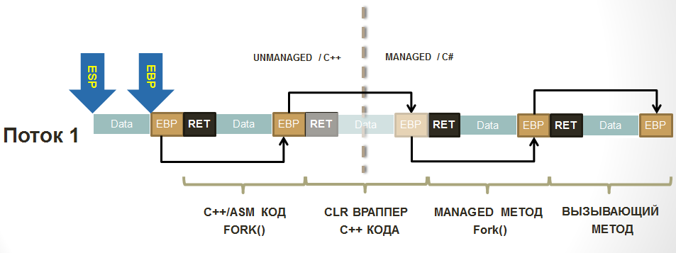
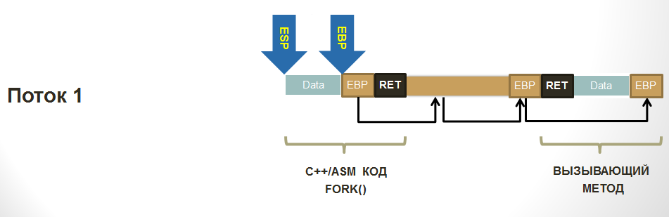
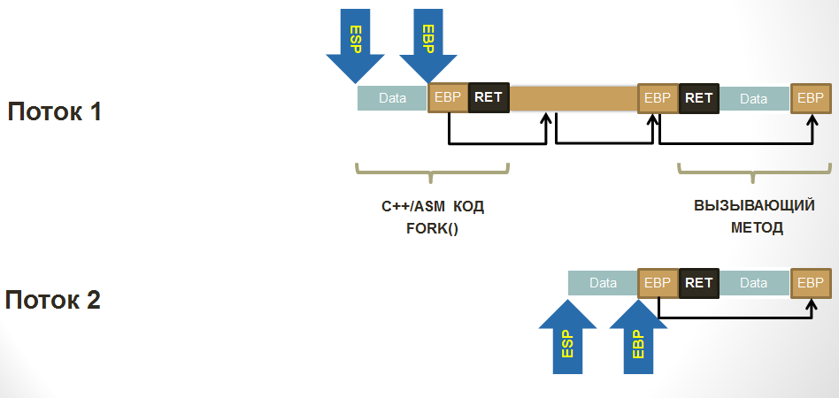
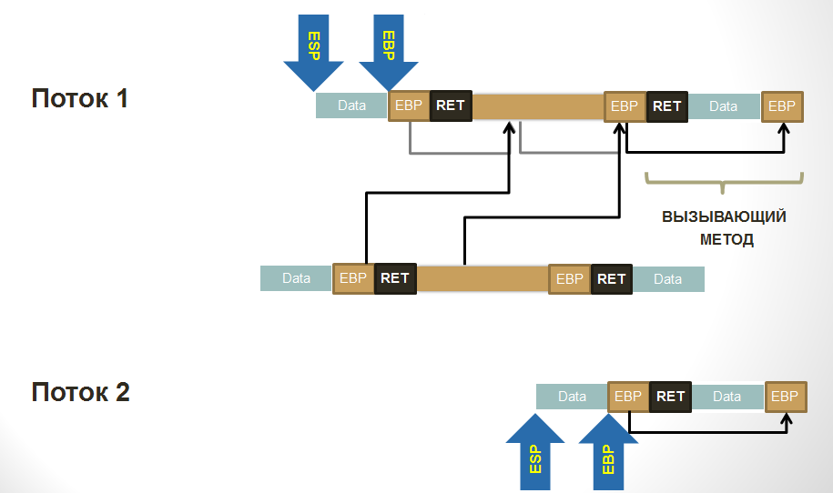
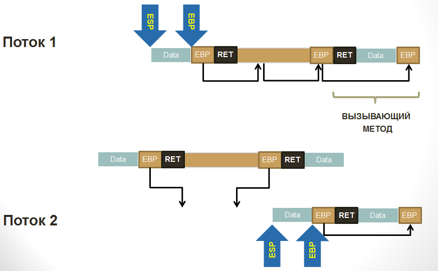
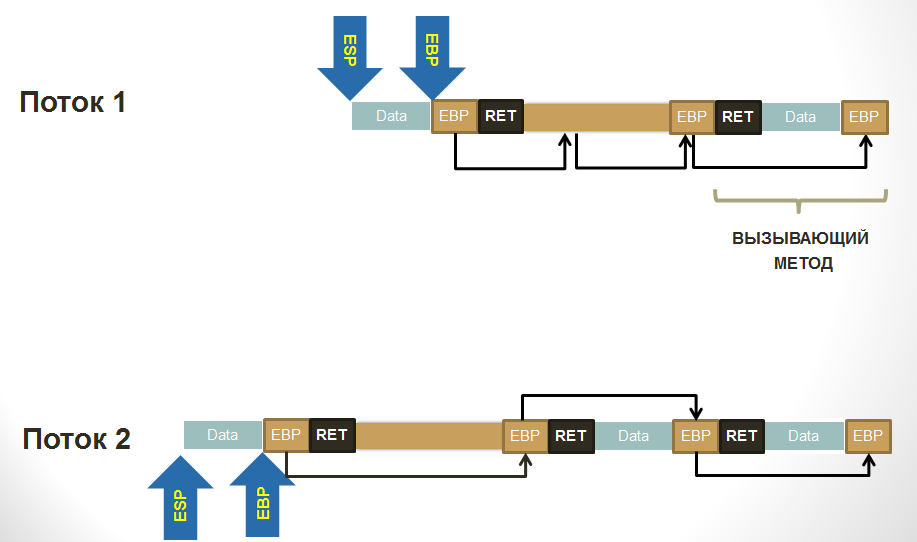

# Стек потока

## Базовая структура

Существует область памяти, про которую редко заходит разговор. Однако эта область является, возможно, основной в работе приложения. Самой часто используемой, достаточно ограниченной с моментальным выделением и освобождением памяти. Область эта называется "стек потока". Причем поскольку указатель на него кодируется по своей сути регистрами процессора, которые входят в контекст потока, то в рамках исполнения любого потока стек потока свой. Зачем он необходим?

Итак, разберем элементарный пример кода:

```csharp
void Method1()
{
    Method2(123);
}

void Method2(int arg)
{
    // ...
}
```

В данном коде не происходит ничего примечательного, однако не будем его пропускать, а наоборот: посмотрим на него максимально внимательно. Когда любой `Method1` вызывает любой `Method2`, то абсолютно любой такой вызов (и не только в .NET, но и в других платформах) осуществляет следующие операции:

  1. Первое что делает код, скомпилированный JIT'ом: он сохраняет параметры метода в стек (начиная с третьего). При этом первые два передаются через регистры. Тут важно помнить что первым параметром экземплярных методов передается указатель на тот объект, с которым работает метод. Т.е. указатель `this`. Так что в этих (почти всех) случаях для регистров остается всего один параметр. А для всех остальных - стек;
  2. Далее компилятор ставит инструкцию вызова метода `call`, которая помещает в стек адрес возврата из метода: адрес следующей за `call` инструкцией. Таким образом любой метод знает, куда ему необходимо вернуться чтобы вызывающий код смог продолжить работу;
  3. После того как все параметры переданы, а метод вызван нам надо как-то понять как стек восстановить в случае выхода из метода если мы не хотим заботиться о подсчете занимаемых нами в стеке байтов. Для этого мы сохраняем значение регистра EBP, который всегда хранит указатель на начало текущего кадра стека (т.е. участка, где хранится информация для конкретного вызванного метода). Сохраняя при каждом вызове значение этого регистра мы тем самым фактически создаем односвязный список стековых кадров. Но прошу заметить что по факту они идут чётко друг за другом, без каких-либо пробелов. Однако для упрощения освобождения памяти из под кадра и для того чтобы можно было отлаживать приложения (отладчик использует эти указатели чтобы отобразить Stack Trace) односвязный список строится;
  4. Последнее что надо сделать при вызове метода - выделить участок памяти под локальные переменные. Поскольку компилятор заранее знает сколько ее понадобится, то делает он это сразу, сдвигая указатель на вершину стека (SP/ESP/RSP) на необходимое количество байт;
  5. И наконец, на пятом этапе выполняется код метода, полезные операции;
  6. Когда происходит выход из метода, то вершина стека восстанавливается из EBP - места, где хранится начало текущего стекового кадра;
  7. Далее, последним этапом осуществляется выход из метода через инструкцию `ret`. Она забирает со стека адрес возврата, заботливо оставленный ранее инструкцией `call` и делает `jmp` по этому адресу.

Также замечу что стек "растет" начиная со старших адресов и заканчивая младшими, т.е. в обратную сторону.

Глядя на все это, невольно приходишь к выводу что если не большинство, то минимум половина всех операций, которыми занимается процессор - это обслуживание структуры программы, а не ее полезной нагрузки. Т.е. обслуживание вызовов методов, проверки типов на возможность привести один к другому, компиляцию Generic вариаций, поиск методов в таблицах интерфейсов... Особенно если мы вспомним что большинство современного кода написано с подходом работы через интерфейсы, разбивку на множество пусть маленьких но выполняющих каждый - свое - методов.. А работа при этом часто идет с базовыми типами и приведением типов то к интерфейсному, то к наследнику. При всех таких входящих условиях вывод о расточительности инфраструктурного кода вполне может назреть. Единственное, что я могу вам на это все сказать: компиляторы, в том числе и JIT обладают множеством техник, позволяющим им делать более продуктивный код. Где можно - вместо вызова метода вставляется его тело целиком, а где возможно вместо поиска метода в VSD интерфейса осуществляется его прямой вызов. Что самое грустное, инфраструктурную нагрузку очень сложно замерить: надо чтобы JITter либо какой-либо компилятор вставлял бы какие-то метрики до и после мест работы инфраструктурного кода. Т.е. до вызова метода, а внутри метода - после инициализации кадра стека. До выхода из метода, после выхода из метода. До компиляции, после компиляции. И так далее. Однако, давайте не будем о грустном, а поговорим лучше о том, что мы можем с вами сделать с полученной информацией.

## Немного про исключения

Если мы посмотрим внутрь кода методов, то мы заметим еще одну структуру, работающую со стеком потока. Посудите сами: 

```csharp
void Method1()
{
    try
    {
        Method2(123);
    } catch {
        // ...
    }
}

void Method2(int arg)
{
    Method3();
}

void Method3()
{
    try
    {
        //...
    } catch {
        //...
    }
}
```

Если исключение возникнет в любом из методов, вызванных из `Method3`, то управление будет возвращено в блок `catch` метода `Method3`. При этом если исключение обработано не будет, то его обработка начнется в методе `Method1`. Однако если ничего не случится, то `Method3` завершит свою работу, управление перейдет в метод `Method2`, где также может возникнуть исключение. Однако по естественным причинам обработано оно будет не в `Method3`, а в `Method1`. Вопрос такого удобного автоматизма заключается в том что структуры данных, образующие цепочки обработчиков исключений также находятся в стековом кадре метода, где они объявлены. Про сами исключения мы поговорим отдельно, а здесь скажу только что модель исключений в .NET Framework CLR и в Core CLR отличается. CoreCLR вынуждена быть разной на разных платформах, а потому модель исключений там другая и представляется в зависимости от платформы через прослойку PAL (Platform Adaption Layer) различными имплементациями. Большому .NET Framework CLR это не нужно: он живет в экосистеме платформы Windows, в которой есть уже много лет общеизвестный механизм обработки исключений, который называется SEH (Structured Exception Handling). Этот механизм используется практически всеми языками программирования (при конечной компиляции) потому что обеспечивает сквозную обработку исключений между модулями, написанными на различных языках программирования. Работает это примерно так:

  1. При вхождении в блок try на стек кладется структура, которая первым полем указывает на предыдущий блок обработки исключений (например, вызывающий метод, у которого также есть try-catch), тип блока, код исключения и адрес обработчика;
  1. В TEB потока (Thread Environment Block, по сути - контекст потока) меняется адрес текущей вершины цепочки обработчиков исключений на тот что мы создали. Таким образом мы добавили в цепочку наш блок.
  1. Когда try закончился, производится обратная операция: в TEB записывается старая вершина, снимая таким образом наш обработчик из цепочки;
  1. Если возникает исключение, то из TEB забирается вершина и по очереди по цепочке вызываются обработчики, которые проыеряют, подходит ли исключение конкретно им. Если да, выполняется блок обработки (например, catch).
  1. В TEB восстанавливается тот адрес структуры SEH, который находится в стеке ДО метода, обработавшего исключение.

Как видите, совсем не сложно. Однако вся эта информация также находится в стеке.

## Совсем немного про несовершенство стека потока

Давайте немного подумаем о вопросе безопасности и возможных проблемах, которые чисто теоретически могут возникнуть. Для этого давайте еще раз глянем на структуру стека потока, которая по своей сути - обычный массив. Диапазон памяти, в котором строятся фреймы организован так что он растет с конца в начало. Т.е. более поздние фреймы располагаются по более ранним адресам. Также, как уже было сказано, фреймы связаны односвязным списком. Это сделано потому что размер фрейма не является фиксированным и должен быть "считан" любым отладчиком. Процессор при этом не разграничивает фреймы между собой: любой метод по своему желанию может считать всю область памяти целиком. А если учесть при этом что мы находимся в виртуальной памяти, которая поделена на участки, которые являются реально выделенной памятью, то можно при помощи специальной функции WinAPI по любому адресу со стека получить диапазон выделенной памяти, в которой этот адрес находится. Ну а разобрать односвязный список - дело техники:

```csharp
    // переменная находится в стеке
    int x;

    // Забрать информацию об участке памяти, выделенной под стек
    MEMORY_BASIC_INFORMATION *stackData = new MEMORY_BASIC_INFORMATION();
    VirtualQuery((void *)&x, stackData, sizeof(MEMORY_BASIC_INFORMATION));
```

Это дает нам возможность получить и модифицировать все данные, которые находятся в качестве локальных переменных у методов, которые нас вызвали. Если приложение никак не настраивает песочницу, в рамках которой вызываются сторонние библиотеки, расширяющие функционал приложения, то сторонняя библиотека сможет утащить данные даже если тот API, который вы ей отдаете этого не предполагает. Методика эта может показаться вам надуманной, однако в мире C/C++, где нет такой прекрасной вещи как AppDomain с настроенными правами атака по стеку - это самое типичное что только можно встретить из взлома приложений. Мало того, можно через рефлексию посмотреть на тип, который нам необходим, повторить его структуру у себя, а пройдя по ссылке со стека на объект заменить адрес VMT на наш, перенаправив таким образом всю работу с конкретным экземпляром к нам. SEH, кстати говоря, также вовсю используется для взлома приложений. Через него вы также можете меняя адрес обработчика исключения заставлять ОС выполнить вредоносный код. Но вывод из всего этого очень простой: всегда настраивайте песочницу, когда хотите работать с библиотеками, расширяющими функционал вашего приложения. Я, конечно же имею ввиду всяческие плагины, аддоны и прочие расширения.

## Большой пример: клонирование потока [In Progress]

Чтобы запомнить все что мы прочитали до мельчайших подробностей надо зайти к вопросу освещения какой-либо темы с нескольких сторон. Казалось бы, какой пример можно построить для стека потока? Вызвать метод из другого? Магия... Конечно же нет: это мы делаем ежедневно по много раз. Вместо этого мы склонируем поток исполнения. Т.е. сделаем так чтобы после вызова определенного метода у нас вместо одного потока оказалось бы два: наш и новый, но продолжающий выполнять код с точки вызова метода клонирования так как будто он сам туда дошел. А выглядеть это будет так:

```csharp
void MakeFork()
{
    // Для уверенности что все склонировалось мы делаем локальные переменные:
    // В новом потоке их значения обязаны быть такими же как и в родительском
    var sameLocalVariable = 123;
    var sync = new object();

    // Замеряем время
    var stopwatch = Stopwatch.StartNew();

    // Клонируем поток
    var forked = Fork.CloneThread();

    // С этой точки код исполняется двумя потоками. 
    // forked = true для дочернего потока, false для родительского
    lock(sync)
    {
        Console.WriteLine("in {0} thread: {1}, local value: {2}, time to enter = {3} ms",
            forked ? "forked" : "parent",
            Thread.CurrentThread.ManagedThreadId,
            sameLocalVariable,
            stopwatch.ElapsedMilliseconds);
    }

    // При выходе из метода родительский вернет управления в метод,
    // который вызвал MakeFork(), т.е. продолжит работу как ни в чем ни бывало,
    // а дочерний завершит исполнение.
}

// Примерный вывод:
// in forked thread: 2, local value: 123, time to enter = 73 ms
// in parent thread: 1, local value: 123, time to enter = 77 ms
```

Согласитесь, концепт интересный. Конечно же, тут можно много спорить про целесообразность таких действий, но задача этого примера - поставить жирную точку в понимании работы этой структуры данных. Как же сделать клонирование? Для ответа на данный вопрос надо ответить на другой вопрос: что вообще определяет поток? А поток определяют следующие структуры и области данных:

  1. Набор регистров процессора. Все регистры определяют состояние потока исполнения инструкций: от адреса текущей инструкции исполнения до адресов стека потока и данных, которыми он оперирует;
  1. [Thread Environment Block](https://en.wikipedia.org/wiki/Win32_Thread_Information_Block) или TIB/TEB, который хранит системную информацию по потоку включая адреса обработчиков исключений;
  1. Стек потока, адрес которого определяется регистрами SS:ESP;
  1. Платформенный контекст потока, который содержит локальные для потока данные (ссылка идет из TIB)

Ну и наверняка что-то еще, о чем мы можем не знать. Да и знать нам всего для примера нет никакой надобности: в промышленное использование данный код не пойдет, а скорее будет служить нам отличным примером, который поможет разобраться в теме. А потому он не будет учитывать всего, а только самое основное. А для того чтобы он заработал в базовом виде, нам понадобится скопировать в новый поток набор регистров (исправив SS:ESP, т.к. стек будет новым) а также подредактировать сам стек чтобы он содержал ровно то что нам надо.

Итак. Если стек потока определяет по сути, какие методы были вызваны и какими данными они оперируют, то получается что по-идее меняя эти структуры можно поменять как локальные переменные методов так вырезать из стека вызов какого-то метода, поменять метод на другой или же добавить в любое место цепочки свой. Хорошо, с этим определились. Теперь давайте посмотрим на некий псевдокод:

```csharp
void RootMethod()
{
    MakeFork();
}
```

Когда вызовется MakeFork(), что мы ожидаем с точки зрения стек трейсов? Что в родительском потоке все останется без изменений, а дочерний будет взят из пула потоков (для скорости), в нем будет сымитирован вызов метода `MakeFork` вместе с его локальными переменными, а код продолжит выполнение не с начала метода, а с точки, следующей после вызова `CloneThread`. Т.е. стек трейс в наших фантазиях будет выглядеть примерно так:

```csharp
// Parent Thread
RootMethod -> MakeFork

// Child Thread
ThreadPool -> MakeFork
```

Что у нас есть изначально? Есть наш поток. Также есть возможность создать новый поток либо запланировать задачу в пул потоков, выполнив там свой код. Также мы понимаем, что информация по вложенным вызовам хранится в стеке вызовов и что при желании мы можем ей манипулировать (например, используя C++/CLI). Причем, если следовать соглашениям и вписать в верхушку стека адрес возврата для инструкции ret, значение регистра EBP и выделить место под локальные (если необходимо), таким образом можно имитировать вызов метода. Ручную запись в стек потока возможно сделать из C#, однако нам понадобятся регистры их их очень аккуратное использование, а потому без ухода в C++ нам не обойтись. Тут к нам на помощь впервые в жизни (лично у меня) приходит CLI/C++, который позволяет писать смешанный код: часть инструкций - на .NET, часть - на C++, а иногда даже уходить на уровень ассемблера. Именно то, что нам надо.

Итак, как будет выглядеть стек потока, когда наш код вызовет MakeFork, который вызовет CloneThread, который уйдет в unmanaged мир CLI/C++ и вызовет метод клонирование (саму реализацию) - там? Давайте посмотрим на схему (еще раз напомню, что стек растет от старших адресов к младшим. Справа налево): 



Ну а для того чтобы не тащить всю простыню со схемы на схему, упростим, отбросив то, что нам не нужно:



Когда мы создадим поток либо возьмем готовый из пула потоков, то в нашей схеме появляется еще один стек, пока еще ничем не проинициализированный:



Теперь наша задача - сымитировать запуск метода `Fork.CloneThread()` в новом потоке. Для этого мы должны в конец его стека потока дописать серию кадров: как будто из делегата, переданного ThreadPool'у был вызван `Fork.CloneThread()`, из которого через враппер C++ кода managed оберткой был вызван CLI/C++ метод. Для этого мы просто скопируем необходимый участок стека в массив (замечу что со склонированного участка на старый "смотрят" копии регистров EBP, обеспечивающих построение цепочки кадров):



Далее чтобы обеспечить целостность стека после операции копирования склонированного на предыдущем шане участка мы заранее рассчитываем по каким адресам будут находиться поля `EBP` на новом месте и сразу же исправляем их, прямо на копии:



Последним шагом, очень аккуратно, задействуя минимальное количество регистров копируем наш массив в конец стека дочернего потока, после чего сдвигаем регистры ESP и EBP на новые места. С точки зрения стека мы сымитировали вызов всех этих методов:



Но пока не с точки зрения кода. С точки зрения кода нам надо попасть в те методы, которые по только что создали. Самое простое - просто сымитировать выход из метода: восстановить `ESP` до `EBP`, в `EBP` положить то, на что он указывает и вызвать инструкцию `ret`, инициировав выход из якобы вызванного C++ метода клонирования потока, что приведет к возврату в реальный wrapper CLI/C++ вызова, который вернет управление в `MakeFork()`, но в дочернем потоке. Техника сработала.

Теперь давайте взглянем на код. Первое что мы сделаем - это возможность для CLI/C++ кода создать .NET поток. Для этого мы его должны создать в .NET:

```csharp
extern "C" __declspec(dllexport)
void __stdcall MakeManagedThread(AdvancedThreading_Unmanaged *helper, StackInfo *stackCopy)
{
    AdvancedThreading::Fork::MakeThread(helper, stackCopy);
}
```

На типы параметров пока не обращайте внимания. Они нужны для передачи информации о том, какой участок чтека необходимо у себя рисовать из родительского потока в дочерний. Метод создания потока оборачивает в делегает вызов unmanaged метода, передает данные и ставит делегат в очередь на обработку пулом потоков.

```csharp
[MethodImpl(MethodImplOptions::NoInlining | MethodImplOptions::NoOptimization | MethodImplOptions::PreserveSig)]
static void MakeThread(AdvancedThreading_Unmanaged *helper, StackInfo *stackCopy)
{
    ForkData^ data = gcnew ForkData();
    data->helper = helper;
    data->info = stackCopy;

    ThreadPool::QueueUserWorkItem(gcnew WaitCallback(&InForkedThread), data);
}

[MethodImpl(MethodImplOptions::NoInlining | MethodImplOptions::NoOptimization | MethodImplOptions::PreserveSig)]
static void InForkedThread(Object^ state)
{
    ForkData^ data = (ForkData^)state;
    data->helper->InForkedThread(data->info);
}
```

И, наконец, сам метод клонирования (вернее, его .NET часть):

```csharp
[MethodImpl(MethodImplOptions::NoInlining | MethodImplOptions::NoOptimization | MethodImplOptions::PreserveSig)]
static bool CloneThread()
{
    ManualResetEvent^ resetEvent = gcnew ManualResetEvent(false);
    AdvancedThreading_Unmanaged *helper = new AdvancedThreading_Unmanaged();
    int somevalue;

    // *
    helper->stacktop = (int)(int *)&somevalue;
    int forked = helper->ForkImpl();
    if (!forked)
    {
        resetEvent->WaitOne();
    }
    else
    {
        resetEvent->Set();
    }
    return forked;
}
```

Чтобы понимать, где в цепочке кадров стека находится данный метод, мы сохраняем себе адрес стековой переменной (*). Использовать этот адрес мы будем в методе клонирования, речь о котром пойдет чуть ниже. Также, чтобы вы понимали, о чем идет речь, приведу код структуры, необходимой для хранения информации о копии стека:

```csharp
public class StackInfo
{
public:
    // Копия значений регистров
    int EAX, EBX, ECX, EDX;
    int EDI, ESI;
    int ESP;
    int EBP;
    int EIP;
    short CS;

    // Адрес копии стека
    void *frame;

    // Размер копии
    int size;

    // Диапазоны адресов оригинального стека нужны,
    // чтобы поправить адреса на стеке если они есть на новые
    int origStackStart, origStackSize;
};
```

Работа же самого алгоритма разделена на две части: в родительском потоке мы подготавливаем данные для того чтобы в дочернем потоке отрисовать нужные кадры стека. Вторым же этапом - в дочернем потоке - данные восстанавливаются, накладываясь на свой собственный стека потока исполнения имитируя таким образом вызовы методов, которые в реальности вызваны не были.  

### Метод подготовки к копированию

```csharp
int AdvancedThreading_Unmanaged::ForkImpl()
{
    StackInfo copy;
    StackInfo* info;  

    // Save ALL registers
    _asm 
    {
	    mov copy.EAX, EAX
        mov copy.EBX, EBX
        mov copy.ECX, ECX
        mov copy.EDX, EBX
        mov copy.EDI, EDI
        mov copy.ESI, ESI
        mov copy.EBP, EBP
        mov copy.ESP, ESP
        
        // Save CS:EIP for far jmp
        mov copy.CS, CS
        mov copy.EIP, offset JmpPointOnMethodsChainCallEmulation

        // Save mark for this method, from what place it was called
        push 0
    }

JmpPointOnMethodsChainCallEmulation:

    _asm 
    {
        pop EAX
        cmp EAX, 0
        je NonClonned
        
        pop EBP
        mov EAX, 1
        ret
    }
NonClonned:

    int *curptr = (int *)copy.EBP;
    int frames = 0;

    //
    //  Calculate frames count between current call and Fork.CloneTherad() call
    //  
    while ((int)curptr < stacktop)
    {
        curptr = (int*)*curptr;
        frames++;
    }

    //
    //  We need to copy stack part from our method to user code method including its locals in stack
    //
    int localsStart = copy.EBP;                             // our EBP points to EBP value for parent method + saved ESI, EDI
    int localsEnd = *(int *)curptr;                         // points to end of user's method's locals (additional leave)
    
    byte *arr = new byte[localsEnd - localsStart];
    memcpy(arr, (void*)localsStart, localsEnd - localsStart);

    
    // Get information about stack pages
    MEMORY_BASIC_INFORMATION *stackData = new MEMORY_BASIC_INFORMATION();            
    VirtualQuery((void *)copy.EBP, stackData, sizeof(MEMORY_BASIC_INFORMATION));

    // fill StackInfo structure
    info = new StackInfo(copy);
    info->origStackStart = (int)stackData->BaseAddress;
    info->origStackSize = (int)stackData->RegionSize;
    info->frame = arr;
    info->size = (localsEnd - localsStart);

    // call managed new Thread().Start() to make fork
    MakeManagedThread(this, info); 

    return 0;
}
```

### Метод восстановления из копии

```csharp
void AdvancedThreading_Unmanaged::InForkedThread(StackInfo * stackCopy)
{
    StackInfo copy;
    short CS_EIP[3];

    // Save original registers to restore
    __asm pushad

    // safe copy w-out changing registers
    for(int i = 0; i < sizeof(StackInfo); i++)
        ((byte *)&copy)[i] = ((byte *)stackCopy)[i];

    // Setup FWORD for far jmp
    *(int*)CS_EIP = copy.EIP;
    CS_EIP[2] = copy.CS;

    // calculate ranges
    int beg = (int)copy.frame;
    int size = copy.size;    
    int baseFrom = (int) copy.origStackStart;
    int baseTo = baseFrom + (int)copy.origStackSize;
    int ESPr;

    __asm mov ESPr, ESP

    // target = EBP[ - locals - EBP - ret - whole stack frames copy]
    int targetToCopy = ESPr - 8 - size;

    // offset between parent stack and current stack;
    int delta_to_target = (int)targetToCopy - (int)copy.EBP;

    // offset between parent stack start and its copy;
    int delta_to_copy = (int)copy.frame - (int)copy.EBP;

    // In stack copy we have many saved EPBs, which where actually one-way linked list.
    // we need to fix copy to make these pointers correct for our thread's stack.
    int ebp_cur = beg;
    while(true)
    {
        int val = *(int*)ebp_cur;

        if(baseFrom <= val && val < baseTo)
        {
            int localOffset = val + delta_to_copy;
            *(int *)ebp_cur += delta_to_target;
            ebp_cur = localOffset;
        } 
        else 
            break;
    }
        
    CHECKREF(EAX);
    CHECKREF(EBX);
    CHECKREF(ECX);
    CHECKREF(EDX);

    CHECKREF(ESI);
    CHECKREF(EDI);

    // prepare for __asm nret
    __asm push offset RestorePointAfterClonnedExited
    __asm push EBP
    
    for(int i = (size >> 2) - 1; i >= 0; i--)
    {
        int val = ((int *)beg)[i];
        __asm push val;
    };
    
    // restore registers, push 1 for Fork() and jmp
    _asm {        
        push copy.EAX
        push copy.EBX
        push copy.ECX
        push copy.EDX
        push copy.ESI
        push copy.EDI
        pop EDI
        pop ESI
        pop EDX
        pop ECX
        pop EBX
        pop EAX
        push 1
        jmp fword ptr CS_EIP
    }

RestorePointAfterClonnedExited:

    // Restore original registers
    __asm popad
    return;
 }
```