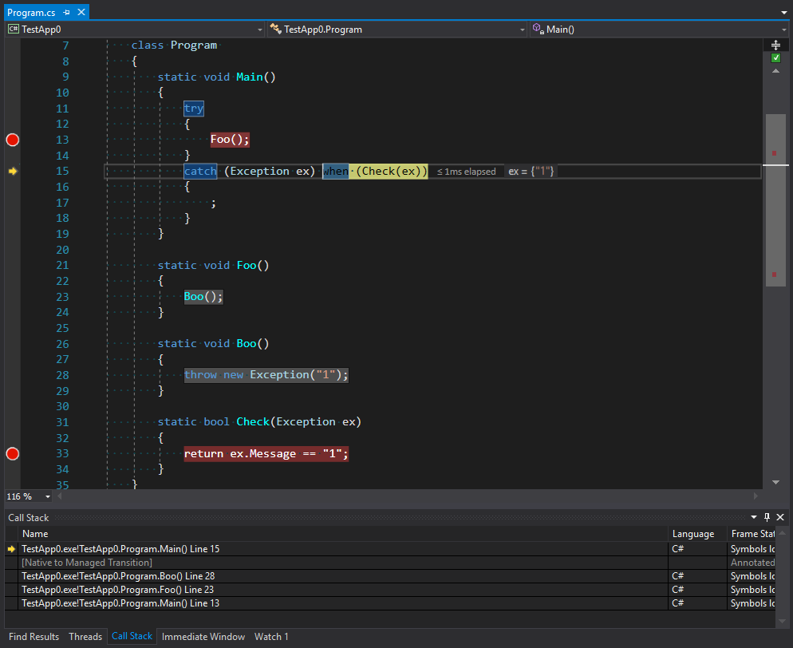
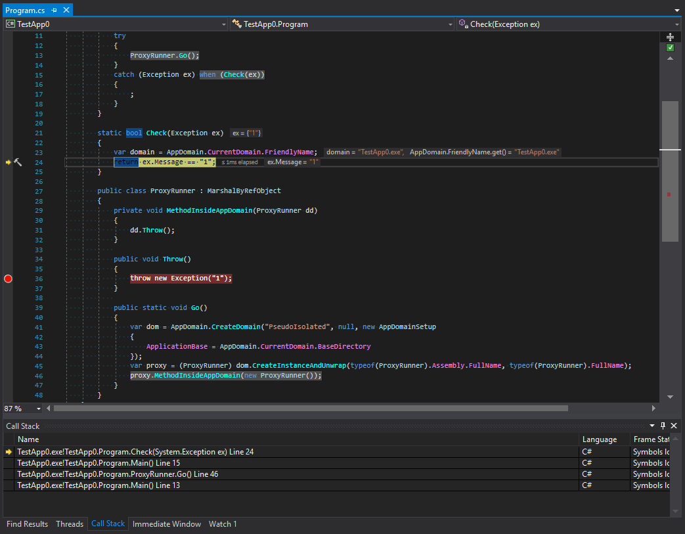

# Exceptions

> [A link to the discussion](https://github.com/sidristij/dotnetbook/issues/51)

It’s time to talk about exceptions or, rather, exceptional situations. Before we start, let’s look at the definition. What is an exceptional situation?

This is a situation that makes the execution of current or subsequent code incorrect. I mean different from how it was designed or intended. Such a situation compromises the integrity of an application or its part, e.g. an object. It brings the application into an extraordinary or exceptional state.

But why do we need to define this terminology? Because it will keep us in some boundaries. If we don’t follow the terminology, we can get too far from a designed concept which may result in many ambiguous situations. Let’s see some practical examples:

```csharp
 struct Number
 {
     public static Number Parse(string source)
     {
         // ...
         if(!parsed)
         {
             throw new ParsingException();
         }
         // ...
     }

     public static bool TryParse(string source, out Number result)
     {
        // ..
        return parsed;
     }
 }
```

This example seems a little strange, and it is for a reason. I made this code slightly artificial to show the importance of problems appearing in it. First, let’s look at the `Parse` method. Why should it throw an exception?

  - Because the parameter it accepts is a string, but its output is a number, which is a value type. This number can’t indicate validity of calculations: it just exists. In other words, the method has no means in its interface to communicate a potential problem.
  - On the other hand, the method expects a correct string that contains some number and no redundant characters. If it doesn’t contain, there is a problem in prerequisites to the method: the code which calls our method has passed wrong data.

Thus, the situation when this method gets a string with incorrect data is exceptional because the method can return neither a correct value nor anything.  Thus, the only way is to throw an exception.

The second variant of the method can signal some problems with input data: the return value here is `boolean` which indicates successful execution of the method. This method doesn’t need to use exceptions to signal any problems: they are all covered by the `false` return value.

## Overview

Exceptions handling might look as easy as ABC: we just need to place `try-catch` blocks and wait for corresponding events. However, this simplicity became possible due to the tremendous work of CLR and CoreCLR teams that unified all the errors that come from all directions and sources into the CLR. To understand what we are going to talk about next, let’s look at a diagram:


We can see that inside big .NET Framework there are two worlds: everything that belongs to CLR and everything that doesn’t, including all possible errors appearing in Windows and other parts of the unsafe world.

  - Structured Exception Handling (SEH) is a standard way Windows handles exceptions. When `unsafe` methods are called and exceptions are thrown, there is the unsafe <-> CLR conversion of exceptions in both directions: from unsafe to CLR and backward. This is because CLR can call an unsafe method which can call a CLR method in turn.
  - Vectored Exception Handling (VEH) is a root of SEH and allows you to put your handlers in places where exceptions might be thrown. In particular, it used for placing `FirstChanceException`.
  - COM+ exceptions appear when the source of a problem is a COM component. In this case, a layer between COM and a .NET method must convert a COM error into a .NET exception.
  - And, of course, wrappers for HRESULT. They are introduced to convert a WinAPI model (an error code is contained in a return value, while return values are obtained using method parameters) into a model of exceptions because it is an exception that is standard for .NET.

On the other hand, there are languages above CLI each of which more or less have functions for handling exceptions. For example, recently VB.NET or F# had a richer exception handling functionality expressed in a number of filters that didn’t exist in C#.

## Return codes vs. exception

Separately, I should mention a model of handling application errors using return codes. The idea of simply returning an error is plain and clear. Moreover, if we treat exceptions as a `goto` operator, the use of return codes becomes more reasonable: in this case, the user of a method sees the possibility of errors and can understand which errors may occur. However, let’s not guess what is better and for what, but discuss the problem of choice using a well reasoned theory.

Let’s suppose that all methods have interfaces to deal with errors. Then all methods would look like:

```csharp
public bool TryParseInteger(string source, out int result);

public DialogBoxResult OpenDialogBox(...);
public WebServiceResult IWebService.GetClientsList(...);

public class DialogBoxResult : ResultBase { ... }
public class WebServiceResult : ResultBase { ... }
```

And their use would look like:

```csharp

public ShowClientsResult ShowClients(string group)
{
    if(!TryParseInteger(group, out var clientsGroupId))
        return new ShowClientsResult { Reason = ShowClientsResult.Reason.ParsingFailed };

    var webResult = _service.GetClientsList(clientsGroupId);
    if(!webResult.Successful)
    {
        return new ShowClientsResult { Reason = ShowClientsResult.Reason.ServiceFailed, WebServiceResult = webResult };
    }

    var dialogResult = _dialogsService.OpenDialogBox(webResult.Result);
    if(!dialogResult.Successful)
    {
        return new ShowClientsResult { Reason = ShowClientsResult.Reason.DialogOpeningFailed, DialogServiceResult = dialogResult };
    }

    return ShowClientsResult.Success();
}
```

You may think this code is overloaded with error handling. However, I would like you to reconsider your position: everything here is an emulation of a mechanism that throws and handles exceptions.

How can a method report a problem? It can do it by using an interface for reporting errors. For example, in `TryParseInteger` method such interface is represented by a return value: if everything is OK, the method will return `true`. If it’s not OK, it will return `false`. However, there is a disadvantage here: the real value is returned via `out int result` parameter. The disadvantage is that on the one hand the return value is logically and by perception has more "return value” essence than that of `out` parameter. On the other hand, we don’t always care about errors. Indeed, if a string intended for parsing comes from a service that generated this string, we don’t need to check it for errors: the string will always be correct and good for parsing. However, suppose we take another implementation of the method:

```csharp
public int ParseInt(string source);
```

Then, there is a question: if a string does have errors, what should the method do? Should it return zero? This won’t be correct: there is no zero in the string. In this case, we have a conflict of interests: the first variant has too much code, while the second variant has no means to report errors. However, it’s actually easy to decide when to use return codes and when to use exceptions.

> If getting an error is a norm, choose a return code. For example, it is normal when a text parsing algorithm encounters errors in a text, but if another algorithm that works with a parsed string gets an error from a parser, it can be critical or, in other words, exceptional.

## Try-Catch-Finally in brief

A `try` block covers a section where a programmer expects to get a critical situation which is treated as a norm by external code. In other words, if some code considers its internal state inconsistent based on some rules and throws an exception, an external system, which has a broader view of the same situation, can catch this exception using a `catch` block and normalize the execution of application code. Thus, *you legalize exceptions in this section of code by catching them*. I think it is an important idea that justifies the ban on catching all `try-catch(Exception ex){ ...}` exceptions *just in case*.

It doesn’t mean that catching exceptions contradicts some ideology. I say that you should catch only the errors that you expect from a particular section of code. For example, you can’t expect all types of exceptions inherited from `ArgumentException` or you can’t get `NullReferenceException`, because often it means that a problem is rather in *your* code than in a called one. But it’s appropriate to expect that you won’t be able to open an intended file. Even if you 200% sure you will be able, don’t forget to check.

The `finally` block is also well known. It is suitable for all cases covered by `try-catch` blocks. Except for several rare _special_ situations, this block will *always* work. Why was such a guarantee of performance introduced? To clean up those resources and groups of objects which were allocated or captured in `try` block and which this block has responsibility for.

This block is often used without `catch` block when we don’t care which error broke an algorithm, but we need to clean up all resources allocated for this algorithm. Let’s look at a simple example: a file copying algorithm needs two open files and a memory range for a cash buffer. Imagine that we allocated memory and opened one file, but couldn’t open another one. To wrap everything in one "transaction” atomically we put all three operations in a single `try` block (as a variant of implementation) with resources cleaned in `finally`. It may seem like a simplified example but the most important is to show the essence.

What C# actually lacks is a `fault` block which is activated whenever an error occurs. It’s like `finally` on steroids. If we had this, we could, for example, create a single entry point to log exceptional situations:

```csharp
try {
    //...
} fault exception
{
    _logger.Warn(exception);
}

```

Another thing I should touch in this introduction is exception filters. It is not a new feature on the .NET platform but C# developers may be new to it: exception filtering appeared only in v. 6.0. Filters should normalize a situation when there is a single type of exception that combines several types of errors. It should help us when we want to deal with a particular scenario but have to catch the whole group of errors first and filter them later. Of course, I mean the code of the following type:

```csharp
try {
    //...
}
catch (ParserException exception)
{
    switch(exception.ErrorCode)
    {
        case ErrorCode.MissingModifier:
            // ...
            break;
        case ErrorCode.MissingBracket:
            // ...
            break;
        default:
            throw;
    }
}
```

Well, we can now rewrite this code properly:

```csharp
try {
    //...
}
catch (ParserException exception) when (exception.ErrorCode == ErrorCode.MissingModifier)
{
    // ...
}
catch (ParserException exception) when (exception.ErrorCode == ErrorCode.MissingBracket)
{
    // ...
}
```

The improvement here is not in the lack of `switch` construct. I believe this new construct is better in several things:

  - using `when` for filtering we catch exactly what we want and it’s right in terms of ideology;
  - the code becomes more readable in this new form. Looking through code our brain can identify blocks for handling errors more easily as it initially searches for `catch` and not `switch-case`;
  - the last but not least: a preliminary comparison is BEFORE entering the catch block. It means that if we make wrong guesses about potential situations, this construct will work faster than `switch` in the case of throwing an exception again.

Many sources say that the peculiar feature of this code is that filtering happens *before* stack unrolling. You can see this in situations when there are no other calls except usual between the place where an exception is thrown and the place where filtering check occurs.

```csharp
static void Main()
{
    try
    {
        Foo();
    }
    catch (Exception ex) when (Check(ex))
    {
        ;
    }
}

static void Foo()
{
    Boo();
}

static void Boo()
{
    throw new Exception("1");
}

static bool Check(Exception ex)
{
    return ex.Message == "1";
}
```



You can see from the image that the stack trace contains not only the first call of `Main` as the point to catch an exception, but the whole stack before the point of throwing an exception plus the second entering into `Main` via unmanaged code. We can suppose that this code is exactly the code for throwing exceptions that is in the stage of filtering and choosing a final handler. However, _not all calls can be handled without stack unrolling_. I believe that excessive uniformity of the platform generates too much confidence in it. For example, when one domain calls a method from another domain it is absolutely transparent in terms of code. However, the way methods calls work is an absolutely different story. We are going to talk about them in the next part.

### Serialization

Let’s start by looking at the results of running the following code (I added the transfer of a call across the boundary between two application domains).

```csharp
    class Program
    {
        static void Main()
        {
            try
            {
                ProxyRunner.Go();
            }
            catch (Exception ex) when (Check(ex))
            {
                ;
            }
        }

        static bool Check(Exception ex)
        {
            var domain = AppDomain.CurrentDomain.FriendlyName; // -> TestApp.exe
            return ex.Message == "1";
        }

        public class ProxyRunner : MarshalByRefObject
        {
            private void MethodInsideAppDomain()
            {
                throw new Exception("1");
            }

            public static void Go()
            {
                var dom = AppDomain.CreateDomain("PseudoIsolated", null, new AppDomainSetup
                {
                    ApplicationBase = AppDomain.CurrentDomain.BaseDirectory
                });
                var proxy = (ProxyRunner) dom.CreateInstanceAndUnwrap(typeof(ProxyRunner).Assembly.FullName, typeof(ProxyRunner).FullName);
                proxy.MethodInsideAppDomain();
            }
        }
    }

```

We can see that stack unrolling happens before we get to filtering. Let’s look at screenshots. The first is taken before the generation of an exception:


The second one is after it:



Let’s study call tracing before and after exceptions are filtered. What happens here? We can see that platform developers made something that at first glance looks like the protection of a subdomain. The tracing is cut after the last method in the call chain and then there is the transfer to another domain. But I think this looks strange. To understand why this happens let’s remember the main rule for types that organize the interaction between domains. These types should inherit `MarshalByRefObject` and be serializable. However, despite the strictness of C# exception types can be of any nature. What does it mean? This means that situations may occur when an exception inside a subdomain can be caught in a parent domain. Also, if a data object that can get into an exceptional situation has some methods that are dangerous in terms of security they can be called in a parent domain. To avoid this, the exception is first serialized and then it crosses the boundary between application domains and appears again with a new stack. Let’s check this theory:

```csharp
[StructLayout(LayoutKind.Explicit)]
class Cast
{
    [FieldOffset(0)]
    public Exception Exception;

    [FieldOffset(0)]
    public object obj;
}

static void Main()
{
    try
    {
        ProxyRunner.Go();
        Console.ReadKey();
    }
    catch (RuntimeWrappedException ex) when (ex.WrappedException is Program)
    {
        ;
    }
}

static bool Check(Exception ex)
{
    var domain = AppDomain.CurrentDomain.FriendlyName; // -> TestApp.exe
    return ex.Message == "1";
}

public class ProxyRunner : MarshalByRefObject
{
    private void MethodInsideAppDomain()
    {
        var x = new Cast {obj = new Program()};
        throw x.Exception;
    }

    public static void Go()
    {
        var dom = AppDomain.CreateDomain("PseudoIsolated", null, new AppDomainSetup
        {
            ApplicationBase = AppDomain.CurrentDomain.BaseDirectory
        });
        var proxy = (ProxyRunner)dom.CreateInstanceAndUnwrap(typeof(ProxyRunner).Assembly.FullName, typeof(ProxyRunner).FullName);
        proxy.MethodInsideAppDomain();
    }
}
```

For C# code could throw an exception of any type (I don’t want to torture you with MSIL) I performed a trick in this example casting a type to a noncomparable one, so we could throw an exception of any type, but the translator would think that we use `Exception` type. We create an instance of the `Program` type, which is not serializable for sure, and throw an exception using this type as workload. The good news is that you get a wrapper for non-Exception exceptions of `RuntimeWrappedException` which will store an instance of our `Program` type object inside and we will be able to catch this exception. However, there is bad news that supports our idea: calling `proxy.MethodInsideAppDomain();` will generate `SerializationException`:


Thus, you can’t transfer such an exception between domains as it is not possible to serialize it. This, in turn, means that using exception filters for wrapping methods calls in other domains will anyway lead to stack unrolling despite that the serialization seems to be unnecessary with `FullTrust` settings of a subdomain.

> We should pay additional attention to the reason why serialization between domains is so necessary. In our artificial example, we create a subdomain which doesn’t have any settings. It means it works in FullTrust way. CLR fully trusts its content and doesn’t run any additional checks. However, when you insert at least one security setting, the full trust will disappear and CLR will start controlling everything that happens inside a subdomain. So, when you have a fully trusted domain you don’t need a serialization. Admit, we don’t need to protect ourselves. But serialization exists not only for protection. Each domain loads all necessary assemblies a second time and creates their copies. Thus, it creates copies of all types and all VMTs. Of course, when passing an object from domain to domain you will get the same object. But its VMTs won’t be its own and this object can’t be cast to another type. In other words, if we create an instance of a `Boo` type and get it in another domain the casting of `(Boo)boo` won’t work. In this case, serialization and deserialization will solve the problem as the object will exist in two domains simultaneously. It will exist with all its data where it was created and it will exist in the domain of usage as a proxy object, ensuring that methods of an original object are called.

By transferring a serialized object between domains you get a full copy of the object from one domain in another one while keeping some delimitation in memory. However, this delimitation is fictional. It is used only for those types that are not in `Shared AppDomain`. Thus, if you throw something non-serializable as an exception, but from `Shared AppDomain`, you won’t get an error of serialization (we can try throwing `Action` instead of `Program`). However, stack unrolling will anyway occur in this case: as both variants should work in a standard way. So that nobody will be confused.

