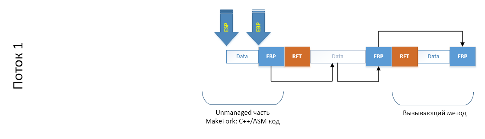
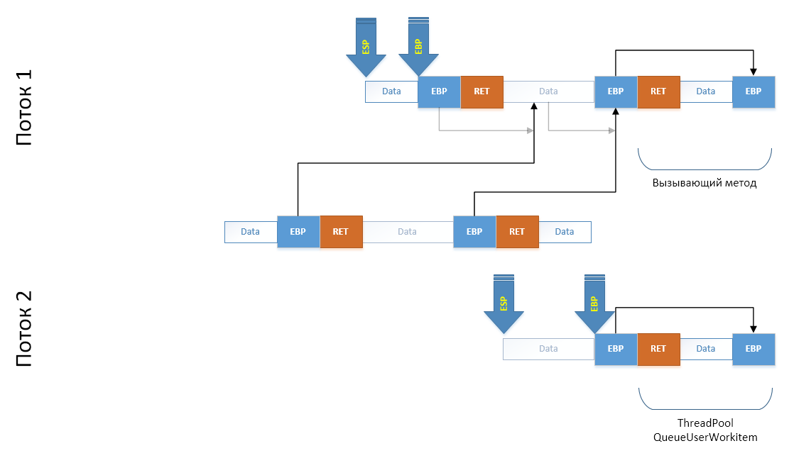
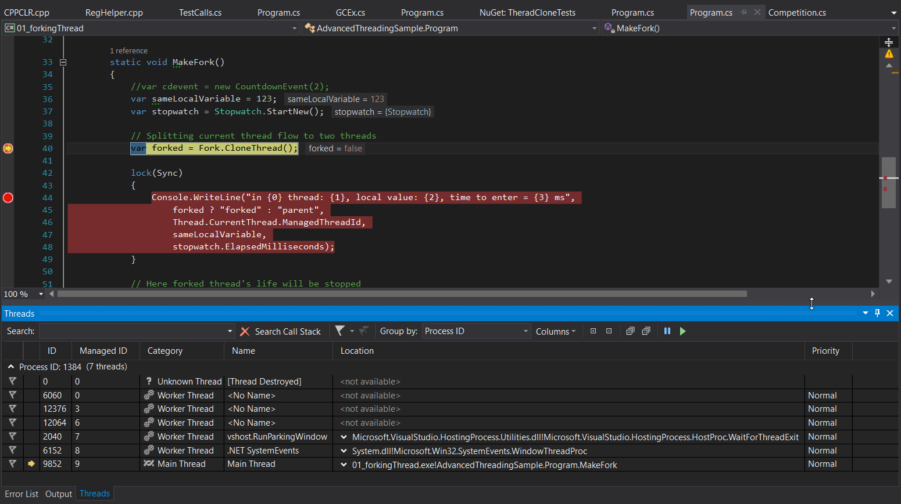

# A thread stack

> [A link to the discussion](https://github.com/sidristij/dotnetbook/issues/58)

## Basic structure, x86 platform

There is a memory region that is rarely mentioned. However, it probably takes a primary role in the work of an application. This is the most frequently used and a quite limited region with instantaneous memory allocation and cleanup. This region is called "a thread stack". And since a pointer to a thread stack is encoded essentially by processor registers which are in the thread context, each thread has its own stack during execution. Why is it necessary?

Let’s review a simple example of code:

```csharp
void Method1()
{
    Method2(123);
}

void Method2(int arg)
{
    // ...
}
```

Nothing significant happens in this code. However, we wouldn’t skip it and instead will examine it carefully . When any `Method1` calls any `Method2`, any such call (not only in .NET but in other platforms too) goes through the following steps:

  1. First, a JIT-compiled code saves method parameters to the stack (starting with a third one). The first two parameters are passed through registers. It is important to remember that the first passed parameter of instance methods is a pointer to an object that the method works with, i.e. `this` pointer. So, in these (almost all) cases only one parameter goes to registers, while the stack is used for the rest.
  2. Next, a compiler puts the `call` method call instruction which puts the method return address to the stack. This is the address of an instruction that follows the `call` instruction. Thus, each method knows where it should return to, so that calling code could continue its work.
  3. After passing all parameters and calling the method we should understand how to restore the stack if we exiting the method and don’t want to calculate bytes occupied in the stack. To do this, we save the value of the EBP register, which always stores a pointer to the beginning of a current stack frame (i.e. a range where the information for a specific called method is stored). Saving the value of this register at each call, we create a single linked list of stack frames. Note that in fact they follow each other precisely without gaps. However, to simplify memory cleanup from a frame and to debug an application (a debugger uses these pointers to show Stack Trace) a single linked list is built.
  4. The last thing to do during the method call is to allocate a memory range for local variables. As a compiler knows in advance how much memory is needed, it allocates it immediately by moving a pointer to the top of the stack (SP/ESP/RSP) by a necessary number of bytes.
  5. The fifth step is the execution of a method code, i.e. useful operations.
  6. While exiting the method, the top of the stack is restored from the EBP which is the place where the beginning of a current stack frame is stored.
  7. And finally, we use `ret` instruction to exit the method.  It takes the return address that was put on the stack by the `call` instruction and makes `jmp` based on this address.

The figure shows these processes:


Note that the stack grows starting from higher and finishing with lower addresses, i.e. in reverse.

Looking at this you may think that if not the majority but at least the half of all operations a processor deals with are to service the structure of a program and not its payload. I mean servicing method calls, checking if one type can be cast to another one, compiling Generic variations, searching methods in interface tables... Especially if we remember that the major part of the modern code is written from the perspective of working through interfaces and implementing a multitude of small methods, each performing its own functions... The work often involves base types and casting types to an interface or to an inheritor. With all these input conditions you might make a conclusion about the lavishness of infrastructure code. The only thing I can tell you is that compilers, including JIT, have a lot of techniques that allow them to create more productive code. Where possible they insert an entire method body instead of calling it and rather than searching a method in an interface VSD, compilers call it directly. The saddest thing is that it’s hard to measure the load on infrastructure: it’s necessary that a JITter or any other compiler inserts some metrics before and after infrastructure code running. That is before a method call and after initializing a stack frame inside this method. Before and after exiting a method. Before compilation and after it. And so on. But let’s not talk about sad things, but discuss what we can do with the obtained information.

## Some words about exceptions in terms of the x86 platform

If we look inside the code of methods, we will see another structure, working with a thread stack. See for yourself:

```csharp
void Method1()
{
    try
    {
        Method2(123);
    } catch {
        // ...
    }
}

void Method2(int arg)
{
    Method3();
}

void Method3()
{
    try
    {
        //...
    } catch {
        //...
    }
}
```

If an exception appears in any method, called from `Method3`, the control will be returned to the `catch` block of `Method3`. If handling of this exception failed, its handling will start in `Method1`. However, if nothing happens, `Method3` will finish its work and control will be passed to `Method2` where an exception can also be thrown. However, naturally, it will be handled in `Method1` and not in `Method3`. The idea of such convenient automation is that data structures that form the chains of exception handlers are also put to the method stack frame where they are declared. We will talk about exceptions separately. Here, I should only note that the model of exceptions in .NET Framework CLR is different from Core CLR. CoreCLR has to be different for various platforms. That’s why it has a distinctive model of exceptions which is offered through PAL (Platform Adaption Layer) in different implementations depending on the platform. Big .NET Framework CLR doesn’t need this as it exists in Windows ecosystem that for many years has been using a common mechanism for exception handling called SEH (Structured Exception Handling). This mechanism is used by almost all programming languages (during final compilation) because it ensures end-to-end exception handling between modules, written in different languages. It works like this:

  1. When a program enters a `try` block, the mechanism puts the structure to the stack , the first field of which indicates a previous block of exception handling (e.g. a calling method which also has try-catch), the type of the block, the exception code and the handler address.
  1. The address of highest-priority exception handler for the Thread Environment Block (TEB)—basically, a thread context—within the chain of handlers is changed to the address created by us. Thus, we added our block to the chain.
  1. After the execution of the `try` block, the mechanism performs a reverse operation: the previous highest-priority handler is registered in TEB, thus pushing our handler out of the chain.  
  1. If an exception occurs, the highest-priority handler is taken from TEB and handlers in the chain are called in turn. Each of them checks whether this exception matches its particular type. If it does, the handling block is activated (e.g., `catch`).
  1. The address of SEH structure which was in the stack BEFORE the exception handler method is restored in TEB. 

As you can see, it’s not so difficult. However, all this information also exists on the stack.

## Basic information about x64 and AMD64 platforms [In Progress]

> TODO

## Basic information about exception handling on x64 and AMD64 platforms [In Progress]

> TODO

## A little about the imperfection of a thread stack

Let’s think about a security issue and possible problems that can appear theoretically. To do this, let’s look again at the structure of a thread stack which is essentially a usual array. The memory range in which frames are built grows from the end to the beginning. It means that more recent frames are assigned initial addresses. As it was said earlier frames are connected through a single linked list. This is because the size of a frame is not fixed and should be "read" by any debugger. A processor, in this case, doesn’t delineate frames from each other: any method can read the entire memory region. And assuming that we are in virtual memory that is divided into ranges of really allocated memory, we can use special WinAPI function and any address on the stack to get an allocated memory range where this address exists. Dealing with a single linked list is easy:

```csharp
    // the variable is on the stack
    int x;

    // Get information about a memory range, allocated for the stack
    MEMORY_BASIC_INFORMATION *stackData = new MEMORY_BASIC_INFORMATION();
    VirtualQuery((void *)&x, stackData, sizeof(MEMORY_BASIC_INFORMATION));
```

Thus we can get and modify all data which exists as local variables in methods that called us. If an application doesn’t adjust the settings of a sandbox used for calling third-party libraries, which enhance the functionality of the application, the third-party library can get data, even if the API you are using doesn’t provide for it. This technique may seem purely artificial, but in the world of C/C++ where there is no AppDomain with configured rights, the attack on the stack is a typical way to hack applications. Moreover, we can use reflection to look at the type we need, replicate its structure on our side and replace the VMT address with our address, using the reference from the stack to an object, and redirect the whole work with a particular instance to our side. By the way, SEH is also actively used to hack applications. Using an exception handler, you can change its address and make OS execute malware code. However, the solution is simple: always adjust the settings of a sandbox when you want to work with libraries, extending the functionality of your application. I mean different plug-ins, add-ons and other extensions.

## A big example: thread cloning on х86 platform

To memorize the details of what we have read, we should look at the same topic from different perspectives. Which example can you really design for a thread stack? Call a method from another? Magic... Of course not: we do it many times every day. Instead, we will copy the execution thread. It means we will ensure that after calling a particular method we would get two threads instead of one: our thread and a new one that continues to execute code from the point of the clone method call as if it got here itself. It will look like this:

```csharp
void MakeFork()
{
    // To ensure everything was cloned, we create local variables:
    // Their values in the new thread should be the same as in the parent one
    var sameLocalVariable = 123;
    var sync = new object();

    // Clocking time
    var stopwatch = Stopwatch.StartNew();

    // Cloning a thread
    var forked = Fork.CloneThread();

    // From now on the code is executed by two threads.
    // forked = true is for the child thread, false is for the parent one
    lock(sync)
    {
        Console.WriteLine("in {0} thread: {1}, local value: {2}, time to enter = {3} ms",
            forked ? "forked" : "parent",
            Thread.CurrentThread.ManagedThreadId,
            sameLocalVariable,
            stopwatch.ElapsedMilliseconds);
    }

    // When exiting the method the parent thread will return control to the method 
    // that called MakeFork(), i.e. will continue work as usual,
    // and the execution of the child thread will finish.
}

// Sample output:
// in forked thread: 2, local value: 123, time to enter = 2 ms
// in parent thread: 1, local value: 123, time to enter = 2 ms
```

Admit, this is an interesting concept. Of course, you may argue a lot about the appropriateness of such actions, but the main task of this example is to put a fine point to the explanations of working principles for this data structure. How do we clone threads? To answer this question, we should understand what things characterize a thread. Actually, it is characterized by the following structures and data regions:

  1. A set of CPU registers. All registers define the state of an execution thread: starting from the address of a current execution instruction to the addresses of a thread stack and the data it uses.
  1. [Thread Environment Block](https://en.wikipedia.org/wiki/Win32_Thread_Information_Block) or TIB/TEB stores system information about a thread, including the addresses of exception handlers.
  1. A thread stack, the address of which is defined by SS:ESP registers.
  1. The platform context of a thread that contains local data for the thread (a reference comes from TIB).

And surely something else that we don’t know. But we don’t have to know everything in case of an example: this code is not for production use, but to understand the idea. That’s why it takes into account only the most important things. If we want this code to function in its basic form, we need to copy a set of registers to a new thread (changing SS:ESP as the stack will be new) and edit the stack itself, so it would contain what we need.

Well, if a thread stack determines which methods were called and which data they use, it means that theoretically by changing these structures you can change local variables of methods and eliminate the call of some method from the stack, replace the method with another or your own method in any place of a chain. Ok, we have decided on this. Now, let’s look at some pseudocode:

```csharp
void RootMethod()
{
    MakeFork();
}
```

When `MakeFork()` is called, what do we expect in terms of stack traces?  We expect that nothing will change in a parent thread, and a child thread will be taken from the thread pool (for speed). The call of `MakeFork` method with its local data will be imitated in this thread, and the execution of code will continue not from the beginning of the method, but from the point after `CloneThread` call. Thus, the stack trace in our imagination will look like:

```csharp
// Parent Thread
RootMethod -> MakeFork

// Child Thread
ThreadPool -> MakeFork
```

What do we have from the beginning? We have our thread. We also have an opportunity to create a new thread or schedule a task to an object pool, executing our code there. We also understand that the information about nested calls is stored in a call stack and we can manipulate it (for example, using C++/CLI). Also, if we implement agreements and put to the stack top the return address for the `ret` instruction as well as the EBP register value and allocate space for locals (if necessary), we can imitate the method call. Manual entries to a thread stack can be made from C#, but we will need registers and will have to use them very carefully. Thus, we can’t do without turning to C++. Here CLI/C++ comes to help us the first time in life (at least for me). It allows writing mixed code: a part of instructions is written in .NET, another part in C++, and the third part can even be written in assembly language. That’s exactly what we need.

So, how will a thread stack look like, when our code will call `MakeFork` which will call `CloneThread` which will go to the unmanaged world of CLI/C++ and call the cloning method (the implementation itself) there? Let’s look at the figure (note once again that the stack is growing from higher to lower addresses. From left to right):


In order not to move the whole thing from figure to figure, let’s simplify it and keep only what we need:



When we create a thread or take a made-up thread from the pool, another stack appears in our figure. However, this stack is not initialized yet.


Now, we need to imitate the running of `Fork.CloneThread()` method in a new thread. To do this, we need to add a series of frames to the end of its thread stack: as if CLI/C++ method was called by a managed wrapper through a C++ wrapper from `Fork.CloneThread()` which was in turn called from a delegate transferred to `ThreadPool`. To do this, we will copy a necessary stack region to an array (note that the copies of EBP registers, used for building a frame chain, in the cloned region “overlook” the former region):



To ensure the integrity of stack after copying the previously cloned region, we estimate in advance which addresses will be taken by EBP fields in a new place and change them to copies immediately: 


The last step is to copy our array to the end of the child thread stack carefully, using a minimal number of registers, and move our ESP and EBP registers to new places. We imitated the call of all these methods in terms of the stack:


But not in terms of code. In terms of code, we need to access those methods that we have just created. The simplest way is to imitate the exit from a method: restore `ESP` from `EBP`, put into `EBP` what it points to and call `ret` instruction, initiating the exit from a supposedly called C++ method for thread cloning. This will end up with returning to a real wrapper of the CLI/C++ call, which will pass control to `MakeFork()`, but in a child thread. This technique works.

Now, let’s look at another code. The first thing we do is the opportunity for CLI/C++ code to create a .NET thread. To do this, we need to create in .NET:

```csharp
extern "C" __declspec(dllexport)
void __stdcall MakeManagedThread(AdvancedThreading_Unmanaged *helper, StackInfo *stackCopy)
{
    AdvancedThreading::Fork::MakeThread(helper, stackCopy);
}
```

Don’t yet pay attention to the types of parameters. They are required to transfer information about which stack region should be copied from a parent stack to a child one. The method of thread creation wraps the call of unmanaged method in a delegate, transfers data and put the delegate into a queue for processing by the thread pool.

```csharp
[MethodImpl(MethodImplOptions::NoInlining | MethodImplOptions::NoOptimization | MethodImplOptions::PreserveSig)]
static void MakeThread(AdvancedThreading_Unmanaged *helper, StackInfo *stackCopy)
{
    ForkData^ data = gcnew ForkData();
    data->helper = helper;
    data->info = stackCopy;

    ThreadPool::QueueUserWorkItem(gcnew WaitCallback(&InForkedThread), data);
}

[MethodImpl(MethodImplOptions::NoInlining | MethodImplOptions::NoOptimization | MethodImplOptions::PreserveSig)]
static void InForkedThread(Object^ state)
{
    ForkData^ data = (ForkData^)state;
    data->helper->InForkedThread(data->info);
}
```

And at last the cloning method itself (its .NET part actually):

```csharp
[MethodImpl(MethodImplOptions::NoInlining | MethodImplOptions::NoOptimization | MethodImplOptions::PreserveSig)]
static bool CloneThread()
{
    ManualResetEvent^ resetEvent = gcnew ManualResetEvent(false);
    AdvancedThreading_Unmanaged *helper = new AdvancedThreading_Unmanaged();
    int somevalue;

    // *
    helper->stacktop = (int)(int *)&somevalue;
    int forked = helper->ForkImpl();
    if (!forked)
    {
        resetEvent->WaitOne();
    }
    else
    {
        resetEvent->Set();
    }
    return forked;
}
```

To understand where this method exists in a chain of stack frames, we have saved the address of a stack variable (*). We will use this address in a cloning method, which will be discussed further. Also, for you to understand what is it all about I will show the code of a structure that is necessary to store information about the stack copy:

```csharp
public class StackInfo
{
public:
    // The copy of registers values
    int EAX, EBX, ECX, EDX;
    int EDI, ESI;
    int ESP;
    int EBP;
    int EIP;
    short CS;

    // The address of a stack copy
    void *frame;

    // The size of a copy
    int size;

    // The address ranges of the original stack are necessary
    // to replace the addresses on the stack, if exist, with new ones
    int origStackStart, origStackSize;
};
```

The work of the algorithm is divided into two stages: firstly, we prepare data in a parent thread to represent necessary stack frames in a child thread. Secondly, the child thread data is restored and overlays its own execution thread stack, thus imitating the calls of methods that were never called. 

### A method of preparation for copying

I will describe the code step-by-step. To do so, I will divide the entire code into parts and comment on each part separately. Let’s start. 

External code calls `Fork.CloneThread()` through an internal wrap over the unmanaged code and through a series of additional methods if code runs while debugging (so-called debugger assistants). That’s why we saved the address of a variable on the stack in the .NET part: for a C++ method this address is a kind of label, and now we know which region of the stack we can copy.

```csharp
int AdvancedThreading_Unmanaged::ForkImpl()
{
    StackInfo copy;
    StackInfo* info;
```

First of all, before any operation, we copy the registers locally to avoid corrupting them. Additionally, we need to save the address of code, where we will make `goto` when the stack will be imitated in a child thread and we will have to exit `CloneThread` in the child thread. As an "exit point” we choose `JmpPointOnMethodsChainCallEmulation` on purpose, because after saving this address "for the future” we additionally put number 0 on the stack. 

```csharp
    // Save ALL registers
    _asm
    {
        mov copy.EAX, EAX
        mov copy.EBX, EBX
        mov copy.ECX, ECX
        mov copy.EDX, EBX
        mov copy.EDI, EDI
        mov copy.ESI, ESI
        mov copy.EBP, EBP
        mov copy.ESP, ESP

        // Save CS:EIP for far jmp
        mov copy.CS, CS
        mov copy.EIP, offset JmpPointOnMethodsChainCallEmulation

        // Save mark for this method to indicate the point it was called from
        push 0
    }
```

Then, after `JmpPointOnMethodsChainCallEmulation` we retrieve this number from the stack and check if it’s still `0`. If it is, then we are still in the same thread which means we have a lot of things to do and we go to `NonCloned`. If the value is `1`, it means that the child thread added all necessary components to the thread stack, put number `1` on the stack and made `goto` to this point (note that `goto` is made from another method). This means it’s time to exit `CloneThread` from the child tread, the call of which was imitated.

```csharp
JmpPointOnMethodsChainCallEmulation:

    _asm
    {
        pop EAX
        cmp EAX, 0
        je NonCloned

        pop EBP
        mov EAX, 1
        ret
    }
NonCloned:
```

OK, we made sure that we have a lot to do and we need to prepare data for the child thread. We will work with the structure of previously saved registers not to go to the assembler language level again. First, let’s get the EBP register value out of this structure. Essentially, the register is the "Next” field in a single linked list of stack frames. Following the address that exists there, we access the frame of a method which called us. If we use the address which is contained in the first field there, we will access an even lower frame. This way we can get to the managed part of `CloneThread` as we saved the address of the variable in its stack frame and know exactly where to stop. The cycle shown below solves exactly this task.

```csharp
    int *curptr = (int *)copy.EBP;
    int frames = 0;

    //
    //  Calculate frames count between a current call and Fork.CloneTherad() call
    //
    while ((int)curptr < stacktop)
    {
        curptr = (int*)*curptr;
        frames++;
    }
```

Because we got the address of `CloneThread` managed method frame beginning we know how much we should copy to imitate the call of `CloneThread` from `MakeFork`. However, since we also need `MakeFork` (we need to exit into it exactly), it’s necessary to make another transition in a single linked list: `*(int *)curptr`. After that, we create an array to save the stack by simple copying.

```csharp
    //
    //  We need to copy the stack part from our method to a user code method including its locals on the stack
    //
    int localsStart = copy.EBP;                             // our EBP points to the EBP value for the parent method + saved ESI, EDI
    int localsEnd = *(int *)curptr;                         // points to the end of a user's method's locals (additional leave)

    byte *arr = new byte[localsEnd - localsStart];
    memcpy(arr, (void*)localsStart, localsEnd - localsStart);
```

Another task to be solved is updating the addresses of variables, which are still on the stack and point to it. To solve this task, we get a range of addresses which were allocated by the operating system for the thread stack. We save the retrieved information and start the second part of a cloning process, preparing a delegate for the thread pool:

```csharp
    // Get information about stack pages
    MEMORY_BASIC_INFORMATION *stackData = new MEMORY_BASIC_INFORMATION();
    VirtualQuery((void *)copy.EBP, stackData, sizeof(MEMORY_BASIC_INFORMATION));

    // fill StackInfo structure
    info = new StackInfo(copy);
    info->origStackStart = (int)stackData->BaseAddress;
    info->origStackSize = (int)stackData->RegionSize;
    info->frame = arr;
    info->size = (localsEnd - localsStart);

    // call managed ThreadPool.QueueUserWorkitem to make fork
    MakeManagedThread(this, info);

    return 0;
}
```

### A method of restoration from a copy

This method is consequentially called after the previous one quits running: we obtained a copy of the parent thread stack region and a full set of its registers. Our task is to add all calls, copied from the parent thread, to our thread, taken from a thread pool, as if we made these calls ourselves. After finishing its work `MakeFork` of the child thread will return to this method which will release the thread and get it back to the pool when work is over.

```csharp
void AdvancedThreading_Unmanaged::InForkedThread(StackInfo * stackCopy)
{
    StackInfo copy;
```

First, we save the values of working registers to restore them painlessly after `MakeFork` finishes its work. To have a minimal impact on registers in the future, we unload the parameters transferred to us on our stack. They will be accessed through `SS:ESP` only , which will be predictable for us.

```csharp
    short CS_EIP[3];

    // Save original registers to restore
    __asm pushad

    // safe copy w-out changing registers
    for(int i = 0; i < sizeof(StackInfo); i++)
        ((byte *)&copy)[i] = ((byte *)stackCopy)[i];

    // Setup FWORD for far jmp
    *(int*)CS_EIP = copy.EIP;
    CS_EIP[2] = copy.CS;
```

Our next task is to correct the `EBP` values in a stack copy that form a single linked list of frames, so they would reflect their future positions. To do this, we calculate the offset between the address of our thread stack and the parent thread stack, the offset between the copy of the parent thread stack range and the parent thread itself.

```csharp
    // calculate ranges
    int beg = (int)copy.frame;
    int size = copy.size;
    int baseFrom = (int) copy.origStackStart;
    int baseTo = baseFrom + (int)copy.origStackSize;
    int ESPr;

    __asm mov ESPr, ESP

    // target = EBP[ - locals - EBP - ret - whole stack frames copy]
    int targetToCopy = ESPr - 8 - size;

    // the offset between the parent stack and the current stack;
    int delta_to_target = (int)targetToCopy - (int)copy.EBP;

    // the offset between the parent stack start and its copy;
    int delta_to_copy = (int)copy.frame - (int)copy.EBP;
```

Using this data we follow the copy of the stack within a cycle and correct the addresses to their future values.

```csharp
    // In the stack copy we have many saved EPBs which form a single linked list.
    // We need to fix the copy to make these pointers appropriate for our thread stack.
    int ebp_cur = beg;
    while(true)
    {
        int val = *(int*)ebp_cur;

        if(baseFrom <= val && val < baseTo)
        {
            int localOffset = val + delta_to_copy;
            *(int *)ebp_cur += delta_to_target;
            ebp_cur = localOffset;
        }
        else
            break;
    }
```

When the single linked list is corrected, we should update the values of registers in their copy, so that if it contains references to the stack, they will be updated too. The algorithm here is not precise at all. Because if an inappropriate value from the stack address range appears there by some reason, it will be corrected by mistake. However, our task is just to understand the functioning of a thread stack and that’s why this technique is suitable for this purpose.

```csharp
    CHECKREF(EAX);
    CHECKREF(EBX);
    CHECKREF(ECX);
    CHECKREF(EDX);

    CHECKREF(ESI);
    CHECKREF(EDI);
```

Now, the most important part. When we add the copy of the parent stack to the end of our stack, everything will be OK until `MakeFork` in the child thread tries to exit (make `return`). We need to show it where it should exit to. To do this, we also imitate the call of `MakeFork` itself from this method. We put the address of `RestorePointAfterClonedExited` label on the stack as if the `call` processor instruction puts the return address and the current `EBP` to the stack, imitating the building of a single linked list of method frames chains. Then we put a copy of the parent stack on the stack using the usual `push` operation, thus representing all methods, called in the parent stack from the `MakeFork` method including itself. The stack is ready!

```csharp
    // prepare for __asm nret
    __asm push offset RestorePointAfterClonedExited
    __asm push EBP

    for(int i = (size >> 2) - 1; i >= 0; i--)
    {
        int val = ((int *)beg)[i];
        __asm push val;
    };
```

Next, we should restore registers.

```
    // restore registers, push 1 for Fork() and jmp
    _asm {
        push copy.EAX
        push copy.EBX
        push copy.ECX
        push copy.EDX
        push copy.ESI
        push copy.EDI
        pop EDI
        pop ESI
        pop EDX
        pop ECX
        pop EBX
        pop EAX
```

Now, it’s time to remember the strange code where we put `0` on stack and then checked for `0`. In this thread, we put `1` and make a long `jmp` to the `ForkImpl` method code. Because we are exactly there according to the stack, but in fact, we are still here. When we get there `ForkImpl` will recognize the change of a thread and will exit to the `MakeFork` method, which will get to the `RestorePointAfterClonedExited` after finishing its work because earlier we imitated the call of `MakeFork` from this point. By restoring the registers to the state of “just called from `ThreadPool`” we finish work, giving the thread to the pool.

```csharp
        push 1
        jmp fword ptr CS_EIP
    }

RestorePointAfterClonedExited:

    // Restore original registers
    __asm popad
    return;
 }
```

Let’s check. This screenshot is made before a thread cloning call:



This screenshot is made after:


As we see now, there are two threads in `ForkImpl` instead of one. Both of them exited this method.

# A few words about a lower level

If we look at an even lower level, we will recall that the memory is, in fact, virtual and it is divided into 8 and 4 Kb pages. Each of these pages can either exist or not exist physically. If it exists, it can be mapped to a file or real RAM. It is exactly this virtualization mechanism that allows applications to have separate memory and provides security levels between an application and an operating system. What does this have to do with a thread stack? As any other random access memory of an application a thread stack is its part and also consists of 4 and 8 Kb pages. On the sides of a range allocated for the stack, there are two pages. An attempt to access these pages will produce an exception, notifying an OS that an application tries to address an unallocated memory range. The actually allocated ranges inside this region are those pages which the application addressed: if the application allocates 2 Mb of memory for a thread, that doesn’t mean they will be allocated straight away. They will be allocated on demand: if a thread stack will grow up to 1 Mb, that will mean that the application got exactly 1 Mb of RAM for the stack.

When an application allocates memory for local variables, two things happen: the value of ESP register grows and the memory for variables is set to null. That’s why when you write a recursive method which enters infinite recursion, you will get `StackOverflowException`: acquiring the entire memory allocated for the stack (the entire available region), you will run into a special Guard Page the access to which will make an operating system initiate `StackOverflow` at the OS level. It will pass to .NET and will be caught resulting in `StackOverflowException` for a .NET application.

# The memory allocation on the stack: `stackalloc`

In C# there is a quite interesting and rarely used keyword `stackalloc`. It is so rarely used in code (I’d rather say "never" instead of "rarely") that it’s hard to find a suitable example of its use and it’s even harder to create an example because if it’s seldom used the experience of working with it is too little. Why? Because for those who try to figure out what this instruction does, `stackalloc` becomes more threatening than useful, as the dark side of `stackalloc` is unsafe code. The result it returns is not a managed pointer: the value is a usual pointer to the range of unprotected memory. And if you make an entry at this address after a method finishes its work, you will start writing to local variables of some method or will overwrite the return address from the method, and an application will finish work with an error. However, our task is to get to hidden corners and figure out what they hide. Also, we should understand that this instrument was created on purpose and not just to spill our water and slip on it. Quite opposite: we were giving this instrument to use it and create really quick software. Did I inspire you? Then, let’s start.

To find the appropriate use cases for this keyword, we should turn to its authors, i.e. Microsoft and see how they use it. We can do this with the help of a full-text search in the  [coreclr repository](https://github.com/dotnet/coreclr). Besides different tests of the keyword itself, we will find no more than 25 use cases of this keyword in the library code. I hope I motivated you enough in the previous paragraph and you won’t stop reading my work when you see such a small number. To say the truth, the CLR team is more far-sighted and professional than the .NET Framework team. And if they created something, it should help us a lot. But if it is not used in .NET Framework... Well, we can suppose that not all engineers there know there is such a powerful optimization instrument. Otherwise, its would be more widely used. 

**Interop.ReadDir class**
[/src/mscorlib/shared/Interop/Unix/System.Native/Interop.ReadDir.cs](https://github.com/dotnet/coreclr/blob/b29f6328510207970763580d6f4db864e4b198af/src/mscorlib/shared/Interop/Unix/System.Native/Interop.ReadDir.cs#L71-L83)

```csharp
unsafe
{
    // s_readBufferSize is zero when the native implementation does not support reading into a buffer.
    byte* buffer = stackalloc byte[s_readBufferSize];
    InternalDirectoryEntry temp;
    int ret = ReadDirR(dir.DangerousGetHandle(), buffer, s_readBufferSize, out temp);
    // We copy data into DirectoryEntry to ensure there are no dangling references.
    outputEntry = ret == 0 ?
                new DirectoryEntry() { InodeName = GetDirectoryEntryName(temp), InodeType = temp.InodeType } :
                default(DirectoryEntry);

    return ret;
}
```

What is `stackalloc` used here for? As we see the code goes to the unsafe method after memory allocation to fill the created buffer with data. That means a memory range that the unsafe method needs for a record is allocated right on the stack dynamically. It’s a great optimization, given that alternatives are to get a memory range from Windows or fixed (pinned) .NET array that besides burdening the heap also burdens the GC because the array is fixed, so the GC wouldn’t move it when accessing its data. By allocating memory on the stack we risk nothing: the allocation is almost instantaneous and we can easily fill it with data and exit this method. And together with the exit from the method, its stack frame will disappear. As a result, we save a lot of time.

Let’s look at another example:

**Class Number.Formatting::FormatDecimal**
[/src/mscorlib/shared/System/Number.Formatting.cs](https://github.com/dotnet/coreclr/blob/efebb38f3c18425c57f94ff910a50e038d13c848/src/mscorlib/shared/System/Number.Formatting.cs#L287-L311)

```csharp
public static string FormatDecimal(decimal value, ReadOnlySpan<char> format, NumberFormatInfo info)
{
    char fmt = ParseFormatSpecifier(format, out int digits);

    NumberBuffer number = default;
    DecimalToNumber(value, ref number);

    ValueStringBuilder sb;
    unsafe
    {
        char* stackPtr = stackalloc char[CharStackBufferSize];
        sb = new ValueStringBuilder(new Span<char>(stackPtr, CharStackBufferSize));
    }

    if (fmt != 0)
    {
        NumberToString(ref sb, ref number, fmt, digits, info, isDecimal:true);
    }
    else
    {
        NumberToStringFormat(ref sb, ref number, format, info);
    }

    return sb.ToString();
}
```

This is an example of number formatting which is based on an even more interesting example of a class [ValueStringBuilder](https://github.com/dotnet/coreclr/blob/efebb38f3c18425c57f94ff910a50e038d13c848/src/mscorlib/shared/System/Text/ValueStringBuilder.cs), working on the basis of `Span<T>`. The essence of this code section is that it doesn’t use the allocation of memory for the character accumulation buffer to collect the textual representation of a formatted number as quickly as possible. This wonderful code allocates memory right in the method stack frame, ensuring no need for the GC to collect garbage in StringBuilder instances if the method worked on its basis. The method run time also decreases: the memory allocation in the heap also takes time. Besides, using `Span<T>` type instead of bare pointers make the work of `stackalloc` based code look safer.

Also, before making conclusions I should show what you mustn’t do. In other words, I will show which code can work well but will fail at the worst possible time. Let’s look at the example:

```csharp
void GenerateNoise(int noiseLength)
{
    var buf = new Span(stackalloc int[noiseLength]);
    // generate noise
}
```

This little code can cause a lot of troubles: you can’t just pass the size to allocate memory on the stack from the outside. If you need a size which is set externally, accept the buffer itself:

```csharp
void GenerateNoise(Span<int> noiseBuf)
{
    // generate noise
}
```

This code is more informative as it makes a user think and be careful when choosing numbers. In case of bad luck, the first variant can produce `StackOverflowException` with a method not being quite deep into a thread stack: it is enough to pass a big number as a parameter. The second variant when you can actually accept the size is when this method is called in specific cases and the calling code "knows" the working algorithm of this method. Without knowing the internal structure of a method there is no specific idea about the possible range for `noiseLength` and as a result errors can occur. 

The second example which I see is that if we misdetermined the size of a buffer which we allocated on the stack and we don’t want to decrease the efficiency of work, we can take a number of ways: allocate more memory on the stack or allocate it in the heap. The second variant will probably be more appropriate in most cases (this is what was done in the case of `ValueStringBuffer`) as it is safer in respect of getting `StackOverflowException`.

## Conclusions on `stackalloc`

So, what is `stackalloc` best used for?

 - To work with unmanaged code when it is necessary to fill some data buffer with an unmanaged method or accept some data buffer from an unmanaged method which will be used during the method body lifetime.

 - For methods that need an array, but again while these methods work. The example with formatting is very good: this method can be called too often to avoid allocating temporary arrays in the heap.

The use of this allocator can significantly increase the performance of your applications.

# Conclusions on section

Of course in general terms, we don’t need to edit the stack in production code: only if we want to spend our time solving an interesting problem. However, understanding its structure shows us that it’s apparently simple to edit it and get data from it. I mean if you create an API to extend the functionality of your application and if this API doesn’t give access to some data, that doesn’t mean that this data can’t be accessed. That’s why always check that your application is hack proof.