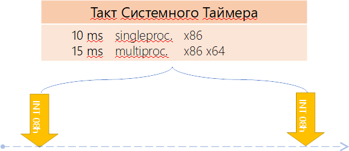
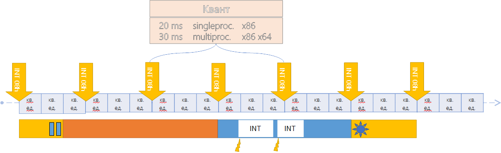
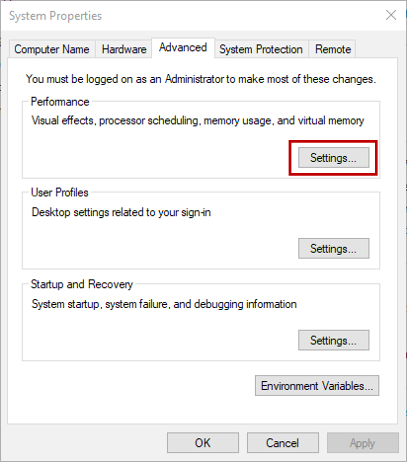
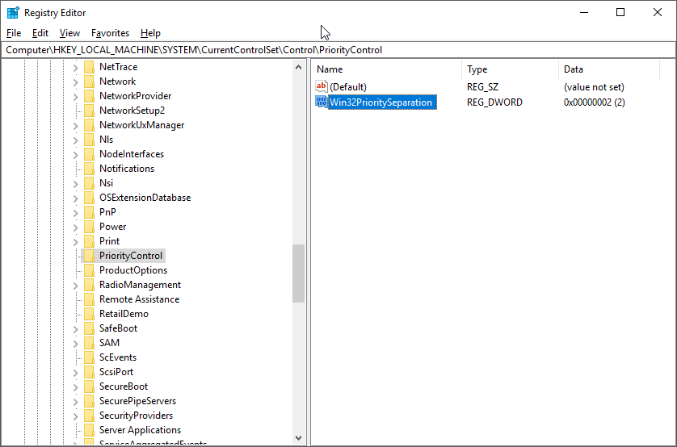

## Планирование потоков

> Пока что всё будет рассказано на основе ОС Windows

Для того чтобы понимать, в каком порядке исполнять код различных потоков, необходима организация планирования этих потоков к исполнению. Ведь система может иметь как одно ядро, так и несколько. Как иметь эмуляцию двух ядер на одном так и не иметь такой эмуляции. И на каждом из ядер: железных или же эмулированных необходимо исполнять как один поток, так и несколько. В конце концов система может работать в режиме виртуализации: в облаке, в виртуальной машине, песочнице в рамках другой операционной системы. Поэтому мы в обязательном порядке рассмотрим планирование потоков операционной системой: платформа .NET этими вопросами не занимается вообще, но запускаясь в рамках операционной системы .NET как и любое другое приложение работает в рамках законов этой операционной системы. Эта информация -- настолько важная часть материала по многопоточке, что без его понимания многопоточка не встанет на своё место в нашей голове никоим образом.

Организация планирования потоков в операционной системе Windows является гибридной. С одной стороны -- моделируются условия вытесняющей многозадачности, когда операционная система сама решает, когда и на основе каких условиях вытеснять потоки для того чтобы дать время поработать остальным (поведение почти во всех приложениях). С другой стороны -- кооперативной многозадачности, когда потоки сами решают, когда они всё сделали и можно переключаться на следующий (UMS планировщик, создаваемый пользовательским кодом вручную. Используется крайне редко) или же доступный нам `Thread.Yield()`, отдающий остаток кванта другим потокам.

Режим вытесняющей многозадачности работает на основе приоритетов: планировщик решает, *какой* следующий поток будет исполняться именно на основе их приоритетов. А вытесняющей потому, что если по какой-то причине возникает более приоритетный поток, он вытесняет тот, который сейчас исполнялся *моментально*. Однако, забегая вперёд, можно сделать поспешный вывод, что во многих случаях это бы означало, что часть потоков из-за их низких приоритетов никогда не доберется до исполнения. Однако это не так: в операционной системе есть много механик, позволяющих низкоприоритетным потокам получить время на исполнение.

### Уровни приоритета

ОС Windows имеет 32 уровня приоритета (0-31) исполнения потоков:

- 1 уровень (00 - 00) -- это Zero Page Thread;
- 15 уровней (01 - 15) -- обычные динамические приоритеты;
- 16 уровней (16 - 31) -- приоритеты псевдо- реального времени.


Изображение 1. Уровни приоритета {.description}

Самый низкий приоритет (#1) имеет `Zero Page Thread`. Это -- специальный поток операционной системы, который обнуляет страницы оперативной памяти, вычищая тем самым данные, которые там находились, но более не нужны, т.к. страница была освобождена (например по результатам работы GC освободилось много памяти и тот решил отдать часть операционной системе). Необходимо это по одной простой причине: когда приложение освобождает память (а делаем мы это чаще всего не обнуляя поля классов), оно может ненароком отдать кому-то чувствительные данные. Личные данные, пароли, что-то ещё. Поэтому как операционная система так и runtime языков программирования (а у нас -- .NET CLR) обнуляют получаемые в распоряжение участки памяти. Если операционная система понимает, что заняться особо нечем: потоки либо стоят в блокировке в ожидании чего-либо либо нет потоков, которые исполняются, то она запускает самый низко приоритетный поток: поток обнуления памяти. Если она не доберется этим потоком до каких-либо участков, не страшно: их обнулят по требованию: когда эти участки запросят как свободные. Но если есть время, почему бы это не сделать заранее?

Дополнительно стоит отметить приоритеты реального времени, которые когда-то давным-давно таковыми являлись, но быстро потеряли свой статус приоритетов реального времени и от этого статуса осталось лишь название. Другими словами, Real Time приоритеты на самом деле не являются таковыми, но небольшая разница всё же есть. В зависимости от сценария ОС может временно менять значение приоритета потока в большую сторону (об этом мы поговорим позже). Однако пересекать границу приоритетов 15-16 такое повышение не может: это запрещено. И мне лично сложно придумать сценарий, когда такой высокий уровень приоритета может чему-либо пригодиться. Тем более если учесть, что понятие потока для системы -- сквозное через процессы. Т.е. повышая уровень приоритета для какого-либо потока в системе это влияет не на процесс, а на всю систему в целом. Да и в целом сложно придумать, когда понадобится именно повышать приоритет относительно других потоков. Понижать -- легко: какие-то фоновые процессы в сервисе вполне могут работать по такому сценарию, срабатывая тогда, когда на них хватает времени. Когда загрузка не уходит в 100% на ядро.

Мало того, повышение приоритета у некоторого потока относительно других увеличит его время исполнения, да. Но и уменьшит время исполнения остальных потоков. Это приведет к проседанию метрик стандартного пула потоков .NET и как результат (он-то не в курсе что есть высокоприоритетный поток) пул начнёт накидывать потоков для увеличения уровня параллелизма. Что в свою очередь приведет к увеличенному "холостому ходу" самого пула: он всё чаще начнет встречаться с собственным кодом, пытаясь забрать из очереди делегатов очередной делегат (очередь общая, потоков много).

### Уровень приоритетов **процессов** с позиции Windows API

Приоритеты -- штука *относительная*. Это тоже очень важно запомнить. И чтобы нам всем было проще в приоритетах ориентироваться, были введены некие правила относительности расчетов:
- приоритет потоков выставляется внутри приложения;
- также есть приоритет приложения относительно друг друга;
- однако для планировщика потоков не процессов: он работает только с приоритетами потоков;
- это значит, что выставленный программистом приоритет - не окончательный. Окончательный вычисляется с учётом приоритета процесса.
- поэтому может оказаться, что повышенный приоритет потока приложения с низким приоритетом меньше приоритета потока с пониженным приоритетом приложения с высоким приоритетом (масло масленое...). И наоборот.

Но обо всём по порядку. Во-первых все потоки от всех приложений равны для планировщика. Планировщик не видит процессы: он видит **только** потоки. Далее, когда программист пишет свою программу, он явно или неявно (значениями по-умолчанию) задаёт приоритет для различных потоков, создавая тем самым модель многопоточности внутри своего приложения (у нас в .NET это уровень по умолчанию, некий "средний", на котором работают практически все потоки пользовательских программ). Он прекрасно знает, почему в одном месте им был выбран пониженный приоритет, в другом -- средний и почему иногда срабатывает специальный поток с повышенным приоритетом. Внутри приложения всё настроено и эти значения не изменятся: даже когда изменится приоритет процесса. Называется это *относительным приоритетом*.

Далее, поскольку есть некий пользователь, он также может выстраивать приоритеты для *процессов*, которые запускаются на операционной системе. Например, он может выбрать повышенный приоритет для какого-то web-сервиса, отдавая ему тем самым максимум ресурсов (более высокий, чем, например, у антивируса). Таким образом уровень приоритета можно задать и у процесса. Называется такой приоритет *классом приоритетов*.

Изменение уровня приоритета процесса не меняет *относительных приоритетов* потоков внутри приложения: их итоговые значения сдвигаются, но не меняется внутренняя модель приоритетов внутри приложения: внутри по-прежнему будет поток с пониженным приоритетом, поток -- с обычным и поток с повышенным. Так, как этого хотел разработчик приложения. Как же это работает?

Существует 6 *классов приоритетов* процессов. Класс приоритетов процессов -- это то, относительно чего будут создаваться приоритеты потоков. Все эти классы приоритетов можно увидеть в "Диспетчере задач", при изменении приоритета какого-либо процесса.

|    Название     | Класс  | Базовый приоритет  |
|-----------------|--------|--------------------|
| 1. Real Time    |   4    |    24              |
| 2. High         |   3    |    13              |
| 3. Above Normal |   6    |    10              |
| 4. Normal       |   2    |    8               |
| 5. Below Normal |   5    |    6               |
| 6. Idle         |   1    |    4               |

Таблица 1. Уровни базовых приоритетов {.description}

Другими словами класс приоритета -- это то, относительно чего будут задаваться приоритеты потоков внутри приложения. Чтобы задать точку отсчёта, было введено понятие *базового приоритета*. Базовый приоритет -- это то **значение**, чем будет являться приоритет потока с типом приоритета **Normal**:

- Если процесс создаётся с *классом Normal* и внутри этого процесса создаётся поток с *приоритетом Normal*, то его **реальный приоритет Normal будет равен 8** (строка №4 в таблице);
- Если Вы создаёте процесс и у него *класс приоритета Above Normal*, то *базовый приоритет* будет равен 10. Это значит, что потоки внутри этого процесса будут создаваться с более повышенным приоритетом: **Normal будет равен уже не 8, а 10**.

Для чего это необходимо? Вы как программисты знаете модель многопоточности, которая у вас присутствует. Потоков может быть много и вы решаете, что один поток должен быть фоновым, так как он, например, считает какие-то метрики или вычисления и вам не столь важно, когда данные станут доступны: важно чтобы поток *когда-нибудь* завершил вычисления (например поток обхода и анализа дерева). Поэтому, вы устанавливаете пониженный приоритет данного потока. Аналогично может сложится ситуация когда необходимо запустить поток с повышенным приоритетом.

Представим, что ваше приложение запускает пользователь и он решает, что ваше приложение потребляет слишком много процессорных ресурсов. Пользователь считает, что ваше приложение не столь важное в системе, как какие-нибудь другие приложения и понижает приоритет вашего приложения до Below Normal. Это означает, что он задаёт базовый приоритет 6 относительно которого будут рассчитываться приоритеты потоков внутри вашего приложения. В самом приложении всё еще будет некий поток со средним приоритетом, один с пониженным и один с повышенным относительно этого среднего. Но в системе класс приоритета процесса упадёт и вместе с ним пересчитаются приоритеты его потоков. Как они при этом поменяются?

|                     | Уровни насыщения  |
|---------------------|-------------------|
|   1. Time Critical  | (+15)             |
|   2. Higest         | (+2)              |
|   3. Above normal   | (+1)              |
|   4. Normal         | (+0)              |
|   5. Below normal   | (-1)              |
|   6. Lowest         | (-2)              |
|   7. Idle           | (-15)             |

Таблица 2. Уровни насыщения {.description}

Normal остаётся на уровне +0 относительно уровня базового приоритета процесса. Below normal -- это (-1) относительно уровня базового. Т.е. в нашем примере с понижением уровня приоритета процесса до класса `Below Normal` приоритет потока 'Below Normal' пересчитается и будет не `8 - 1 = 7` (каким он был при классе `Normal`), а  `6 - 1 = 5`.  Lowest (-2) станет равным `4`. Поток с повышенным приоритетом Highest получит уровень `10 - 1 = 9`.

Почему Normal -- это `0` и относительно него всего два шага: -2, -1, +1 и +2? Легко провести параллель с обучением. Мы ходим в школу, получаем оценки наших знаний (5,4,3,2,1) и нам понятно, что это за оценки: 5 -- молодец, 4 -- хорошо, 3 -- вообще не постарался, 2 -- это не делал ни чего, а 1 -- это то, что можно исправить потом на 4. Но если у нас вводится 10-ти бальная система оценок (или что вообще ужас -- 100-бальная), то возникает неясность: что такое 9 баллов или 7? Как понять, что вам поставили 3 или 4?

Тоже самое и с приоритетами. У нас есть Normal. Дальше, относительно Normal у нас есть чуть повыше Normal (Normal above) и чуть пониже Normal (Normal below). Также есть шаг на два вверх или на два вниз (Higest и Lowest). Нам, поверьте, нет никакой необходимости в более подробной градации. Единственное, очень редко, может раз в жизни, нам понадобится сказать: выше чем любой приоритет в системе. Тогда мы выставляем уровень `Time Critical`. Либо наоборот: вдруг надо что-то сделать, когда во всей системе делать нечего. Тогда мы выставляем уровень `Idle`. Это значения -- так называемые уровни насыщения.

### Как рассчитываются уровни приоритета


Пусть у нашего приложения класс приоритета процесса равен Normal (Таблица 3), тогда приоритет потоков Normal -- это 8. Если процесс Above Normal то поток Normal получается равен 9. Если же процесс выставлен в Higest, то поток Normal получается равен 10.

Поскольку для планировщика потоков Windows все потоки процессов равнозначны, то:

- Для процесса класса Normal с потоком Above-Normal;
- Для процесса класса Higest с потоком Normal.

конечные приоритеты будут одинаковыми и равны 10. Другими словами система их приоритеты будет рассматривать как одинаковые.

Как уже обсуждалось, группа приоритетов Real-Time на самом деле не является таковой, поскольку настоящий Real-Time -- это гарантированная доставка сообщения за определённое время либо обработка его получения. Т.е., другими словами, если на конкретном ядре есть такой поток, других там быть не должно. Однако это ведь не так: система может решить, что низкоприоритетный поток давно не работал и дать ему время, отключив real-time. Поэтому правильнее его назвать классом приоритетов который работает над обычными приоритетами и куда обычные приоритеты не могут уйти, попав под ситуации, когда Windows временно повышает им приоритет.

| Класс приоритета / относительный приоритет | Real-Time | High | Above-Normal | Normal | Below-Normal | Idle |
|--------------------------------------------|-----------|------|--------------|--------|--------------|------|
| Time Critical (+насыщение)                 |     31    |  15  |      15      |   15   |       15     |  15  |
| Highest (+2)                               |     26    |  15  |      12      |   10   |       8      |   6  |
| Above Normal (+1)                          |     25    |  14  |      11      |    9   |       7      |   5  |
| Normal (0)                                 |     24    |  13  |      10      |    8   |       6      |   4  |
| Below Normal (-1)                          |     23    |  12  |       9      |    7   |       5      |   3  |
| Lowest (-2)                                |     22    |  11  |       8      |    6   |       4      |   2  |
| Idle (-насыщение)                          |     16    |   1  |       1      |    1   |       1      |   1  |

Таблица 3. Соотношение класса приоритета и реального приоритета {.description}

Если перевести в графический вид, то можно заметить, что классы приоритетов пересекаются. Например, существует пересечение Above-Normal Normal Below-Normal (столбик с квадратиками):


Это значит, что для этих трех классов приоритетов процессов существуют такие приоритеты потоков внутри этих классов, что реальный их приоритет будет идентичен.

### Состояние потока

Поток в терминологии планирования может находиться в нескольких состояниях, образуя этими состояниями конечный автомат, в рамках которого работает поток. Когда создаётся поток, он создаётся в статусе *Initialized*. Т.е. он проинициализирован и готов к работе. Далее, когда пользовательский код стартует поток, тот переводится в статус *Ready*. Т.е. готовности к исполнению. Другими словами, поток готов к тому, что его в любой момент начнут исполнять на каком-либо процессорном ядре. Спустя некоторое время планировщик просыпается чтобы выбрать следующий к исполнению на текущем процессорном ядре поток (для каждого ядра создается свой планировщик). Для этого он рукодоствуется рядом правил: некоторым потокам он временно повышает приоритет (поговорим об этом чуть позже), некоторые находятся в блокировке и поэтому не участвуют в планировании (планировщик на них даже не смотрит). В любом случае, проснувшись, он выбирает поток, на который будет переключено текущее процессорное ядро из списка готовых к исполнению. Т.е. тех, кто в своей машине состояний находится в состоянии *Ready*.

Когда планировщик выбрал поток, он снимает его из очереди потоков со статусом *Ready* и переводит его в состояние *Standby* -- некоторое промежуточное состояние. После этого планировщик должен заменить активный поток на текущем ядре. Для этого он устанавливает состояние регистров процессора в то, каким оно было когда-то на момент прерывания планировщиком. Тем самым процессор переносится в то расчётное состояние, каким оно было на момент прерывания планирощиком. Далее он изменяет статус потока в состояние исполнения **Running** и запускает прерванный ранее код. Всё: активный поток на текущем ядре заменили на следующий по списку.

Каждому потоку даётся накоторый промежуток времени, в течении которого он может исполняться прежде чем его прервут чтобы отдать время другому. Этот промежуток называется *квантом*. Именно благодаря дроблению времени на кванты и благодаря тому, что все потоки исполняются друг за другом (но понемногу) и возникает иллюзия параллельности исполнения программ. Да, на различных ядрах код исполняется истинно параллельно. Но в рамках одного ядра -- нет. Именно поэтому если ядер у процессора много, код на них может работать быстрее.

Когда же поток отрабатывает свой квант времени, планировщик его переводит в состояние *Ready* или *Waiting*. В состояние *Waiting* поток входит в том случае, если он входит блокировку (блокировки уровня ядра: mutex, semaphore, работа с дисковой системой ввода/вывода и т.п.). Когда поток находится в состоянии Waiting, процессор вообще не тратит время на данный поток т.к. он исчезает из планирования. Когда блокировка будет снята (например, `event.Set()`), поток переводится в состояние Ready и после того, как до него доходит очередь он начинает выполняться. Существует дополнительное состояние *Transition*, но мы его рассматривать не будем. И последнее состояние: *Terminated* -- это когда жизнь потока завершена.

За каждым ядром операционная система закрепляет свой планировщик потоков (на котором "крутится" несколько потоков). Допустим у нас исполняется 50 *активных* потоков **на одном ядре**. Квант, выделяемый одному потоку варьируется от системы к системе и может быть равен 20 мcек в пользовательском режиме ОС Windows. Это значит, что каждый поток получит время на исполнение примерно 1 раз в `50 * 20 = 1000 мсек`. **Т.е. один раз в секунду на 20 мcек**. Таким образом, если вы создадите большое количество процессов, в каждом из которых будет как минимум 1 активный поток, который не заблокирован ожиданием ввода или вывода, то вы тем самым не просто делите общее время между всеми участниками, но и оттягиваете следующий момент включения потока в работу.

Двайте обобщим.

Состояния потоков:

- Initialized. Используется при создании потока
- Ready. Готов. Состояние готовности, ожидание выполнения
  - При поиске следующего потока планировщик рассматривает только это состояние
- Deferred Ready. Готовность с отложенным выполнением.
  - Поток выбран на исполнение на выбранном процессоре, но ещё не запущен.
  - Для минимизации блокировки БД планирования
- Standby. В повышенной готовности.
  - Был выбран следующим для исполнения на конкретном процессоре
  - Всё ещё может быть вытеснен более приоритетным потоком
- Running. Выполнение
  - Исполняется до истечения кванта времени
- Waiting
  - Ожидание объекта синхронизации
  - ОС ждёт чего-либо от имени потока
- Transition
  - Если готов к выполнению, но стек ядра выгружен из памяти
- Terminated. Завершён


Изображение 2: Состояние потоков {.description}

На рисунке 3 изображено отношения потоков и процессора. Откуда видно, что потоки к процессору не имеют ни какого отношкния. Для планировщика потоков все они равноценны.

Как это всё работает? Допустим мы имеем три процесса 1, 2 и 4. Есть две группы ядер: каждый со своим планировщиком потоков. Есть приоритезированная очередь потоков. И когда поток планируется в работу и переходит в состояние Ready, это означает, что он встаёт в ту очередь потоков приоритет которой совпадает с приоритетом саомго потока. Если это поток с приоритетом Normal, запущенный внутри приложения с *классом процесса* Normal будет иметь 8. Значит когда он исполнится то из Running он перейдёт в Ready и будет поставлен в очередь 8. Если есть потоки которые также находятся в состоянии Ready, но более высоких приоритетов, то планировщик будет выполнять их в первую очередь и не будет доходить до вашего потока, пока все потоки с более высоким приоритетом не будут исполнены (опять же за исключением некоторых случаев. Например, если планировщиком было замечено, что некоторые потоки не получали работу слишком долго).


Изображение 3: Потоки и процессор {.description}

### Кванты времени

Квант -- это промежуток времени в течение которого поток будет непрерывно исполняться от момента, когда планировщик стартовал либо продолжил исполнение кода потока до момента, когда планировщик решит, что пора переключаться на следующий поток. Другими словами, квант -- отрезок времени, выданный потоку планировщиком для непрерывного исполнения.

Второе понятие, которое необходимо рассмотреть - понятие системного таймера. Системный таймер - это аппаратное устройство, суть которого заключается в том чтобы очень точно с одинаковым диапазоном подавать импульс на некоторое специально для этого предназначенное место в процессоре, вызывая тем самым *прерывание*. Прерывание -- это вызов кода операционной системы путём вызова функции по некоторому индексу в таблице прерываний. Очень грубо говоря, выглядит это примерно так:

```
Action<...>[] int_p = new Action<...>[256];

...

int_p[0x03]();            // Вызов Breakpoint (функция отладчиков IDE)
int_p[0x08]();            // Прерывание системного таймера (от линии IRQ0)
int_p[0x10](arg1, arg2);  // Вызов метода операционной системы BIOS
int_p[0x21](arg1, arg2);  // Вызов метода операционной системы DOS
```

Другими словами, когда аппаратный таймер подает сигнал на IRQ0, тот вызывает функцию, адрес которой программно зарегистрирован как int 0x08. Сама эта функция является функцией вызова планировщика потоков любой операционной системы: Windows или Linux или же какой-то другой. На однопроцессорной системе x86 работа ситемного таймера настроена на срабатывание каждые 10 мсек, тогда как на многопроцессорной системе -- на 15 мсек.



Изображение 4: Потоки и процессор {.description}

Одну треть диапазона между срабатываниями таймера называют **квантовой единицей** (рис. 4). Количество квантовых единиц между сменами активных потоков на одном ядре называется **Значение Перезапуска Кванта** (фактически это в народе и называют квантом). Это значение отличается как в зависимости от операционной системы так и от её версии: серверной или пользовательской. На клиентских системах Windows оно равно 6. Это значит, что количество квантовых единиц, выделяемых потоку для непрерывной работы, равно 6. Поэтому если на клиентской версии Windows пройдёт два такта системного таймера (на однопроцесорной Windows 10мс + 10мс = 20мс), то если учесть, что в такте 3 квантовой единицы, мы и получим значене перезапуска кванта = 6. Т.е. потоки на клиентской Windows меняются каждые 20 мс на однопроцессорной клиентской версии и каждые 30 мс на клиентской многопроцессорной версии.


Изображение 5: Квантовая единица {.description}

- Квантовая Цель = \[Фактич. Квантовые Единицы\] \* \[Тактовых Импульсов на квант времени\]

Временная шкала системного таймера представлена на рисунке 6. Значение перезапуска кванта в клиентских системах Windows равно 6, тогда как в серверных системах Windows оно равно 36, то есть в шесть раз длиннее. А это значит, что потоку для непрерывной работы будет дано уже не 20 мс, а целых 120 мсек. После чего он будет прерван для исполнения другого потока на этом же ядре. Именно поэтому на серверной системе необходимо оставлять только те приложения, которые там должны работать и больше ничего лишнего: каждый новый активный поток оттянет исполнение текущего ещё на 120 мсек.


Изображение 6: Временная шкала системного таймера {.description}

  * Значение Перезапуска Кванта = \[Фактич. Квантовые Единицы\] \* \[Кол-во Квант. Единиц в Такте\]
    * = 6 (2 \* 3 ) в клиентских системах Windows
    * = 36 (12 \* 3) в серверных системах Windows

Предположим, что один из потоков на уровне второй квантовой единицы встал в блокировку (рис. 6). Тогда чтобы процессор не простаивал, этот поток теряет квантовое время и оно отдаётся другому потоку. Другой поток начал свою работу. Но поскольку планировщик запускается только когда срабатывает системный таймер, то следующий поток отработает дольше. Следующий же за ним поток отработает уже положенное время. Получается так, что если вы работаете с блокировками, то ваше приложение будет выполняться малое количество времени. Во время работы потока могут возникнуть аппаратные прерывания (INT). Прерывания это отвлечение процессора от выполнения текущего потока для выполнения более важных задач (получение состояния внешних устройств и т.п.). Обработка прерывания занимает время потока, но вас это не должно беспокоить потому, что время затраченное на обработку прерывания не учитывается в планировании и соответственно ваш поток 
отработает дольше. Далее, когда поток, освобождённый от блокировки, просыпается, то он дорабатывает своё значение квантового перезапуска.



Изображение 7: Работа потока {.description}

Давайте определим количество квантовых циклов на квант. Согласно следующих шагов. Шаги нахождение квантовых циклов на квант:

  * Возьмём тактовую частоту процессора:
    * Выполним команду поцессора <b>сpuid</b>, которая выдаст точное значение частоты нашего процессора в ГГц : GenuineIntel 2601 fffffff00000000 …
  * Переведём её в герцы:
    * var freq = 2601 \* 1,000,000,000 = 2 601 000 000 тактов/сек
  * При помощи утилиты <b>clockres</b> от Sysinternals получаем значение интервала таймера в системе (как часто срабатывает таймер):
    * 15,625 мсек -- то есть у нас многопроцессорная система ( 10 мсек -- однопроцессорная )
  * Преобразуем его в секунды: 
    * 15,625 мсек / 1000 = 0,015625 сек
  * Умножим на кол-во циклов в секунду и получим число тактов на интервал таймера (от "тика" до "тика" системного таймера):
    * 2,601,000,000 тактов/сек  \* 0,015625 сек = 32 837 625 тактов
  * Получим число тактов на квантовую единицу (квантовая единица это 1/3 системного таймера):
    * 32,837,625 / 3 = 10,945,875 тактов или 0x00A70553
  * Если вывести дамп переменной KiCyclesPerClockQuantum, получится схожее значение:
    * lkd> dd nt!KiCyclesPerClockQuantum L1
    * 8149755c 00a70550

Относительно <b>квантовой единицы</b> рассчитывается цель. Эта переменная присутствует в системе, но её можно получить только под отладчиком уровня ядра. Рассчитанное нами значение практически совпадает со значением в системе ( 0x00A70550 ~= 0x00A70553). Итоговые данные для нашего случая представлены в  таблице 5. Она отображает какое количество тактов исполнится в нашем процессе, прежде чем он потеряет управление.

Это важно с нескольких позиций.
  1. Если есть серверное приложение и у нас очень много потоков, и они не очень хорошо организованы, то одни потоки будут 
  "страдать" из-за других, если они работают на одном ядре.
  2. Можно попытаться присвоить потоки каким-то ядрам и тем самым обеспечить им более долгую работу.
  3. Передача процессорного времени другим потокам в случае блокировки
  
| Система    | Знач. Перезапуска Кванта | Квантовая Цель (тактов) |
|------------|--------------------------|-------------------------|
| Клиентская |           6              |       65 675 250        |
| Серверная  |          36              |      394 051 500        |

Таблица 4. Количество тактов на значение перезапуска {.description}

#### Управление величиной кванта

Заходим в свойства своего компьютера. Далее "Change Settings"


Переходим в Perfimance -\> Settings



Переходим на вкладку Advanced. Programs -- это короткие кванты (6). Почему для Desktop у нас выбрано 6? Потому-что, у нас необходима отзывчивость системы, так как за компьютером работае пользователь. Педположим в Chrome открыто 50 вкладок. Если у нас будет установлен квант равный 36 (сервер), то даже перемещение курсора "мыши" по экрану будет притормаживать из-за того что потоку GUI будет выделяться мало времени.

Оптимизация под программы
  * Использование коротких, переменных квантов
  * Режим по-умолчанию для клиентских Windows, включая XBOX, Hololens 
  * Можно выбрать настройку, если серверная ОС установлена как настольная

Оптимизация под фоновые службы
  * Использование длинных, фиксированных квантов
  * Режим по-умолчанию для серверных Windows
  * Можно выбрать настройку, если настольная ОС установлена как серверная
  * Поскольку эффект немедленный, можно выставить настройку перед началом расчётов, а после расчётов (например, утром) – вернуть настройки назад  


### Переменные кванты

Кванты времени бывают не только статичные но и переменные. Статичные кванты это когда в имеете 6 и 36 не зависимо от условий (каких условий?). Переменные кванты в зависимости от условий вам может быть выделено больше процессорного времени на квант. В это условия входит, например, приложение которое сейчас находится на переднем плане -- оно работает дольше, чем все остальные. И, соответственно, быстрее. При копировании файлов, если перемещать курсор "мыши" над окном, то копирование идёт быстрее :) из-за того,  что такие потоки получают временно повышение приоритета.

Если разрешено использование переменных квантов (клиентская ОС):
  * в таблицу переменных квантов загружается PspForegroundQuantum, которая используется функцией PspComputeQuantum, загружается таблица PspVariableQuantums
  * Алгоритм подбирает подходящий индекс кванта в зависимости от того, работает процесс на переднем плане или нет:
    * есть ли в нём поток, владеющий окном переднего плана или нет?
  * В паре с планировщиком потоков, это даёт повышение приоритета для этого процесса.


Запущено два калькулятора: правый -- активный (на переднем плане), левый -- фоновый.  Есть группы квантов: переменные и фиксированные. И в таблице 6 показаны индексы этих калькуляторов. Правый будет иметь индекс 12 или 18, левый -- 6. На пользовательской Windows установлено по умолчанию переменное значение кванта. На сервере, по умолчанию, нет переменных квантов.


| Значение      | Индекс короткого кванта | Индекс длинного кванта |
|---------------|-------------------------|------------------------|
| Переменное    |   6      12      18     |   12     24     36     |
| Фиксированное |  18      18      18     |   36     36     36     |

Настройка меняется в реестре. Можно поменять систему раздачи квантов по адресу `HKLM\SYSTEM\CurrentControlSet\PriorityControl`.



|   4                  |        3 \| 2            |       1 \| 0       |
|----------------------|--------------------------|--------------------|
| короткие или длинные | Переменные/фиксированные | Разнос приоритетов |

Параметр побитово делится на три зоны. 
Короткие или длинные
  * 0 или 3 – короткие для клиенских, длинные для серверных
  * 1 – длинные кванты
  * 2 – короткие кванты

Переменные или фиксированные
  * 0 или 3 – переменные для клиенских, фиксированные для серверных
  * 1 – переменные кванты

Разнос приоритетов
  * 0 - 2 – определяет приоритетное разделение

## Выводы

  1. Когда поток входит в блокировку, он перестаёт учавствовать в планировании.
  2. На однопроцессорной системе планировщик всегда забирает поток сверху, поэтому он и называется во первых, с приоритетами,
  во вторых он вытесняющий. Если появляется поток с более высоким приоритетом, то планировщик вытесняет исполняемый поток 
  и переключается на поток с большим приоритетом.
  3. Важно знать, что есть кванты. Квант -- это достаточно длинная по времени процедура. И независимо от того, 
  прерывается ли ваш поток, время, которое выделено потоку, он отработает
  4. Если поток переходит в блокировку, то часть времени переходит другому потоку