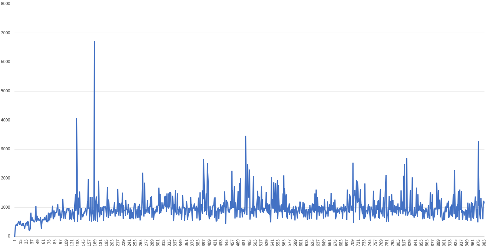
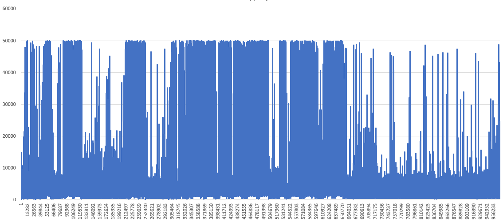
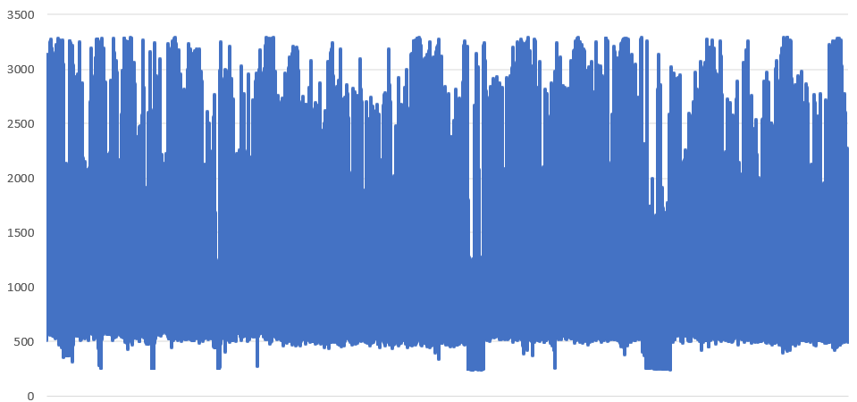
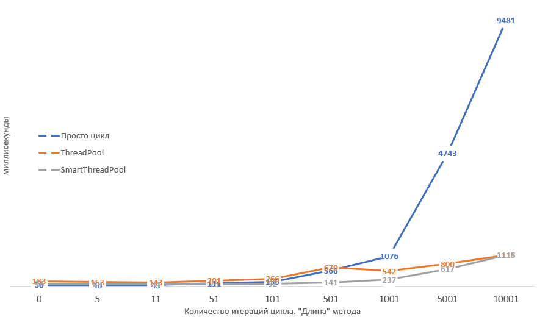
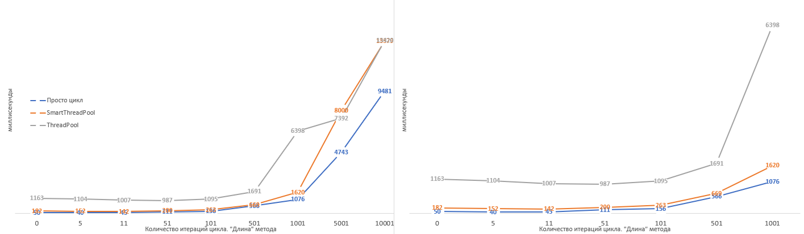

# Основы многопоточности в .NET

> 🥤 *Материал начальной сложности*

Эта глава покрывает ответы на некоторые совсем базовые вопросы и вместе с тем сразу погружает в проблематику получения ответа на вопрос: "как работать лучше? однопоточно, многопоточно или многопоточно, но на ThreadPool?". Ответ на этот вопрос может изначально показаться очень простым и понятным, однако реальность совершенно иная: всё как и везде сильно зависит от ситуации: от типа задачи, от её размера, от прочих условий, которые так просто в голову сами собой не придут.

А потому мы пройдёмся в первую очередь по IO-/CPU-bound операциям, стоимости создания потока, базовым основам работы пула потоков (но только основы), а далее -- углубимся в анализ чёрного ящика: от чего зависит производительность пула потоков? Каков объём работы приемлим для того чтобы в него планировать? 

Закончим мы главу несколькими, возможно, пугающими выводами об объемах работы, приемлимой для того чтобы обеспечить производительную работу приложения на пуле потоков.

## Перед тем, как начать

Главу о многопоточности стоит начать с мыслей о том, что вся многопоточность в вопросах потоков и блокировок .NET основана на функционале операционной системы. Это значит, что в .NET нет никаких своих, тонких потоков. Зато есть обёртки над потоками операционной системы и над блокировками, которые также корнями уходят в операционную систему.

В общем потому-то и необходимо начинать изучение многопоточности с уровня операционной системы, иначе нет никакого реального представления об алгоритмах работы потоков. Для обычного, разаботчика в сфере .NET потоки -- это скорее неясная абстракция чем что-то понятное. А потому -- нет понимания, что такое блокировка. Что такое синхронизация уровня ядра и чем она отличается от синхронизации пользовательского уровня.

А потому если вы начали с этой главы, вернитесь, пожалуйста, назад. В предудущих главах описаны очень важные вещи, которые выведут ваши знания на новый уровень (а вместе с ними -- и уровень оплаты труда).

## Thread

Что такое поток? Проговорим ещё раз. Это некая последовательность команд для процессора, которые он исполняет единым *потоком* параллельно либо псевдопараллельно относительно других *потоков* исполнения кода. Параллельно -- потому что код разных потоков может исполняться на разных физических ядрах. Псевдопараллельно -- потому что код разных потоков может исполняться на одном физическом ядре. А потому -- чтобы эмулировать параллельность в глазах у пользователя они бьются по времени исполнения на очень короткие интервалы и чередутся, создавая иллюзию параллельного исполнения: это можно сравнить с цветной печатью. Если посмотреть на полноцветную печать под лупой (или при помощи камеры смартфона), можно заметить микроточки CMYK (Cyan, Magneta, Yellow, Key). Их можно увидеть только при увеличении, но на расстоянии они образуют единое пятно итогового цвета.

Добиться того, чтобы завладеть ядром процессора монопольно в .NET нет возможности. Да и в ОС нет такого функционала. А это значит, что любой ваш поток будет прерван в абсолютно любом месте: даже по середине операции `a = b;`, когда `b` считали, а `a` ещё не записана просто потому, что помимо вас на том же ярде работает ещё кто-то. И с очень высокой долей вероятности прерваны вы будете на более длительный срок нежели вам отпущено на работу: при большом количестве активных потоков в системе помимо вас на ядре их будет несколько. А значит вы будете по чуть-чуть исполняться в порядке некоторой очереди. Сначала вы, потом все остальные и только потом -- снова вы.

Однако, создание потока -- это очень дорогая операция. Ведь что такое "создать поток"? Для начала это обращение в операционную систему. Обращение в операционную систему -- это преодоление барьера между слоем прикладного ПО и слоем операционной системы. Слои эти обеспечиваются процессором, а стороны барьеров - *кольцами защиты*. Прикладное программное обеспечение имеет кольцо защиты `Ring 3`, тогда как уровень ОС занимает кольцо `Ring 0`. Вызов методов из кольца в кольцо -- операция дорогая, а перехода между тем два: из `Ring 3` в `Ring 0` и обратно. Плюс создание стеков потока: один для `Ring 3`, второй -- для `Ring 0`. Плюс создание дополнительных структур данных со стороны .NET. В общем чтобы что-то исполнить параллельно чему-то *быстро*, для начала придётся потратить много времени. 

Однако люди заметили, что долгих операций, которые бы исполнялись непрерывно, не уходя в ожидание оборудования, мало. Скорее это выглядит так:
1. *Ожидание сети по вопросу подключения клиента*
2. Проанализировали запрос, сформировали запрос к БД, отправили
3. *Ожидание ответа от сервера БД*
4. Ответ получен, перевели в ответ от сервиса
5. *Отправили ответ*

И пункты (2) и (4) -- не так долго выполняются. Скорее это -- очень короткие по времени исполнения участки кода. А потому стоит задаться вопросом: для чего под них создавать отдельные потоки (тут отсылка к неверному многими трактовании слова *асинхронно* и повсеместной попытки что-то отработать параллельно)? В конце концов цепочка (1) - (5) работает целиком последовательно, а это значит, что в точках (1), (3) и (5) поток исполнения находится в блокировке ожидания оборудования, т.к. ждёт ответа от сетевой карты. Т.е. не участвует в планировании операционной системой и никак не влияет на её производительность. Тогда что, web-серверу надо создать поток под всю цепочку? А если сервер обрабатывает 1000 подключений в секунду? Мы же помним, что один поток создаётся крайне долго. Значит он не сможет работать с такими скоростями если будет создавать под каждый запрос поток. Работать на уже существующих? *Брать потоки в аренду?*

## ThreadPool

Именно поэтому и возник пул потоков, ThreadPool. Он решает несколько задач:
- с одной стороны он абстрагирует создание потока: мы этим заниматься не должны
- создав когда-то поток, он исполняет на нём совершенно разные задачи. Вам же не важно, на каком из них исполняться? Главное чтобы был
    - а потому мы более не тратим время на создание потока ОС: мы работаем на уже созданных
    - а потому нагружая ThreadPool своими делегатами мы можем равномерно загрузить ядра CPU работой
- либо ограничивает пропускную способность либо наоборот: даёт возможность работать на все 100% от всех процессорных ядер.

Однако, как мы убедимся позже у любой такой абстракции есть масса нюансов, в которых эта абстракция работает очень плохо и может стать причиной серъёзных проблем. Пул потоков можно использовать не во всех сценариях, а во многих он станет серьёзным "замедлителем" процессов. Однако давайте взглянем на ситуацию под другим углом. Зачастую при объяснении какой-либо темы автором перечисляются функционал и возможности, но совершенно не объясняется "зачем": как будто и так всё понятно. Мы же попробуем пойти другим путём. Давайте попробуем понять ThreadPool. 

И если взглянуть на вопрос с той стороны что пул потоков -- это инструмент, то как следствие возникает вопрос: какие задачи должен решать этот инструмент? 

### С точки зрения упрощения менеджмента параллелизма

Управлять параллелизмом - задача не из простых. Вернее, конечно же, это сильно зависит от того, что вам необходимо.... Но когда у вас "ничего особенного" не требуется, вручную создавать потоки и гнать через них поток задач станет переусложнением. Тем более что это достаточно рутинная операция. Поэтому наличие стандартного функционала в библиотеке классов выглядит крайне логично.

Единственное, что команда Microsoft сделала неправильно -- что сделала ThreadPool статическим классом без возможности повлиять на реализацию. Это ограничение создало целый пласт недопонимания между разработчиком runtime и конечным разработчиком потому как у последнего нет никакого ощущения, что можно разработать свои пулы потоков и что ими можно пользоваться в рамках текущей реализации. Что есть абстракции над пулами потоков, отдавая которые во внешние алгоритмы вы заставляете их ими пользоваться вместо того чтобы пользоваться стандартным, общим пулом.

Но если закрыть глаза на эти недочёты (к которым мы вернёмся позже), то с точки упрощения менеджмента параллелизма, конечно, пул потоков -- идеальное решение. Ведь в конечном счёте параллельно исполняющийся код -- просто набор множества задач, которым совершенно не важен поток, на котором они работают. Им важно исполняться параллельно друг другу. Вам даже не так важно количество. Вам важно, чтобы CPU расходовался оптимально. 

>{.big-quote} Пока мы будем рассматривать ThreadPool как *идеальный* пул потоков, который без всяких проблем сопровождает задачу из одного потока в другой

### С точки зрения IO-/CPU-bound операций

Например, может показаться, что пул потоков создан чтобы решить разделение IO-/CPU-bound операции. И частично это так. Я бы сказал, что пул потоков предоставляет возможность разделения IO-/CPU-bound операций *второго уровня*. В том смысле, что разделение существует и без него и оно находится на более глубоком уровне, на уровне операционной системы. 

Для того чтобы "найти" первый слой разделения IO-/CPU-bound операций необходимо вспомнить как работают потоки. Потоки -- это слой виртуализации параллелизма операционной системой. Это значит, что процессор о потоках не знает ничего, о них знает только ОС и всё, что на ней работает. Плюс к этому существуют блокировки, которых почему-то все боятся (спойлер: зря). Блокировка -- это механизм ожидания сигнала от операционной системы что что-то произошло. Например, что отпустили семафор или что отпустили мьютекс. Но ограничивается ли список блокировок примитивами синхронизации? Исходя из знаний рядового .NET разработчика, да. Но на самом деле это не так. 

Давайте рассмотрим вызов метода мьютекса, приводящий к состоянию блокировки. Любое взаимодействие с операционной системой приводит к проваливанию в более привилегированное кольцо защиты процессора (`Ring 0` для Windows и `Ring 2` в Linux), или говоря языком прикладного программного обеспечения, в kernel space. Это значит, что при проваливании происходит ряд операций, обеспечивающих сокрытие данных ОС от уровня прикладного программного обеспечения. Все эти операции, естественно, стоят времени. Если говорить о пользователе, времени это стоит не так много, потому что пользователь мыслит медленно. Однако с точки зрения программы это время достаточно заметно. Далее, если речь идёт о блокировке, срабатывает ряд достаточно простых механизмов, которые сначала проверяют состояние блокировки: установлена ли блокировка или нет, и если есть, поток переносится из очереди готовности к исполнению в список ожидания снятия блокировки. Что это значит? Поскольку операционная система руководствуется списком готовых к исполнению потоков при выборе того потока, который будет исполняться на процессоре, заблокированный поток она не заметит и потому не станет тратить на него ресурсы. Его просто нет в планировании. А потому легко сделать вывод, что когда поток встаёт в блокировку, он исчезает из планирования на исполнение и потому если все потоки находятся в блокировке, уровень загруженности процессора будет равен 0%.

Однако только ли примитивы синхронизации обладают такими свойствами? Нет: такими же свойствами обладает подавляющее большинство IO-bound операций. Да, взаимодействие с оборудованием может происходить без IO-bound операций. Простым примером такого поведения может быть отображение памяти какого-то устройства на адресное пространство оперативной памяти. Например, видеокарты: сконфигурировав видеокарту, обращаясь к функциям BIOS на необходимый режим работы (текстовый, графический VESA и проч.), помимо перевода экрана в необходимый режим BIOS должен сконфигурировать взаимодействие видеокарты с прикладным ПО. В случае текстового режима BIOS открывает отображение адресного пространства видеокарты на адресное пространство оперативной памяти, на диапазон 0xB8000 и далее. Записав по этому адресу код символа (конечно же, это будет работать, например, в DOS или если вы решите написать свою операционную систему, но не в Windows), вы моментально увидите его на экране. И это не приведет ни к каким блокировкам: запись будет моментальная.

Однако в случае большинства оборудования (например, сетевая карта, жёсткий диск и прочие) у вас будет одна задержка на синхронную подачу команды на оборудование (без перехода в блокировку, но с переходом в kernel space) и вторая задержка -- на ожидание ответа от оборудования. Большинство таких операций сопровождается постановкой потока в заблокированное состояние. Причиной этому служит разность в скорости работы процессора и оборудования, с которым производится взаимодействие: пока некоторая условная сетевая карта осуществляет посылку пакета и далее -- ожидает получения пакетов с ответом на процессорном ядре можно совершить миллионы, миллиарды операций. А потому пока идёт ответ от оборудования можно сделать много чего ещё и чтобы этого добиться поток переводится в заблокированное состояние и исключается из планирования, предоставив другим потокам возможность использовать для своей работы процессор.

По сути механизм блокировок и есть встроенный в операционную систему механизм разделения IO-/CPU-bound операций. Но решает ли он все задачи разделения?

Каждая постановка в блокировку снижает уровень параллелизма с точки зрения IO-bound кода. Т.е., конечно же? операции IO-bound и CPU-bound идут в параллель, но с другой стороны когда некий поток уходит в ожидание, он исчезает из планирования и наше приложение меньше задействует процессор, т.к. с точки зрения только CPU-bound операций мы *теряем* поток исполнения. И уже с точки зрения приложения, а не операционной системы может возникнуть естественное желание занять процессор чем-то ещё. Чтобы это сделать, можно насоздавать потоков и работать на них в параллель, однако это будет достаточно тяжким занятием и потому был придуман следующий очень простой концепт. Создаётся контейнер, который хранит и управляет хранимыми потоками. Этот контейнер, пул потоков, при старте передаёт потоку метод исполнения, который внутри себя в бесконечном цикле разбирает очередь поставленных пулу потоков задач и исполняет их. Какую задачу это решает: программный код построен так, что он, понятно дело исполняется кусочками. Кусочек исполнился, ждём оборудования. Второй кусочек исполнился, ждём оборудования. И так бесконечно. Причем нет же никакой разницы, на каком потоке исполнять вот такие кусочки, верно? А значит их можно отдавать в очередь на исполнение пулу потоков, который будет их разбирать и исполнять. 

Но возникает проблема: ожидание от оборудования происходит в потоке, который инициировал это ожидание. Т.е. если мы будем ожидать в пуле потоков, мы снизим его уровень параллелизма. Как это решить? Инженеры из Microsoft создали для этих целей внутри ThreadPool второй пул: пул ожидающих потоков. И когда некий код, работающий в основном пуле решается встать в блокировку, сделать он это должен не тут же, в основном пуле, а специальным образом: перепланировавшись на второй пул (об этом позже).

Работа запланированных к исполнению делегатов (давайте называть вещи своими именами) на нескольких рабочих потоках, а ожидание - на других, предназначенных для "спячки" реализует второй уровень разделения IO-/CPU-bound операций, когда уже приложение, а не операционная система получает механизм максимального занятия работой процессорных ядер. При наличии постоянной работы (нескончаемого списка делегатов в основном пуле CPU-bound операций) приложение может загрузить процессор на все 100%.

### Прикладной уровень

На прикладном уровне объяснения пул потоков работает крайне просто. Существует очередь делегатов, которые переданы пулу потоков на исполнение. Очередь делегатов хранится в широко-известной коллекции `ConcurrentQueue`. Далее, когда вы вызываете `ThreadPool.QueueUserWorkItem(() => Console.WriteLine($"Hello from {Thread.CurrentThread.ManagedThreadId}"))`, то просто помещаете делегат в эту очередь. 

ThreadPool внутри себя в зависимости от некоторых метрик, о которых мы поговорим позже создаёт некоторое необходимое ему количество рабочих потоков. Каждый из которых содержит цикл выборки делегатов на исполнение: и запускает их. Если упрощать, внутренний код выглядит примерно так:

```csharp
void ThreadMethod()
{

    // ...
    while(needToRun)
    {
        if(_queue.TryDequeue(out var action))
        {
            action();
        }
    }
    // ...
```

Конечно же он сложнее, но общая суть именно такая.

Однако помимо кода, который исполняет процессор (т.н. IO-bound код) существует также код, приводящий к блокировке исполнения потока: ожиданию ответа от оборудования. Клавиатура, мышь, сеть, диск и прочие сигналы от оборудования. Этот код называется IO-bound. Если мы будем ожидать оборудование на потоках пула, это приведёт к тому, что часть потоков в пуле перестенут быть рабочими на время блокировки. Это как минимум испортит пулу потоков статистики которые он считает и как следствие этого пул начнёт работать сильно медленнее. Пока он поймёт, что ему необходимо расширение, пройдёт много времени. У него появится некий "лаг" между наваливанием нагрузки на пул и срабатыванием кода, расширяющего его. А без блокировок-то он отрабатывал бы очень быстро.

Чтобы избежать таких ситуаций и сохранить возможность "аренды" потоков, ввели второй пул потоков. Для IO-bound операций. А потому в стандартном ThreadPool два пула: один -- для CPU-bound операций и второй -- для IO-bound.

Для нас это значит, что в делегате, работающем в ThreadPool вставать блокировку нельзя. Он для этого не предназначен. Вместо этого необходимо использовать следующий код:

{.wide}
```csharp
ThreadPool.QueueuserWorkItem(
    _ => {

        // ... 1

        // 2
        ThreadPool.RegisterWaitForSingleObject(
            waitObject,    // объект ожидания
            (state) => Console.WriteLine($"Hello from {Thread.CurrentThread.ManagedThreadId}"),  // 3
            null,          // объект состояния для передачи в делегат (state)
            0,             // timeout ожидания объекта состояния (0 = бесконечно)
            true);         // ждать ли ещё раз при срабатывании waitObject 
                           // (например, если waitObject == AutoResetEvent)

        // ... 4

    }, null);
);
```

[>]: Тут конечно же стоит помнить о том, что код, который сработает *после* RegisterWaitForSingleObject отработает в лучшем случае параллельно с делегатом, переданным в RegisterWaitForSingleObject, а более вероятно - первее делегата, но в любом случае -- в другом потоке. (1), (2), (3), (4) не будут вызваны последовательно. Последовательно будут вызваны только (1), (2) и (4). А (3) - либо параллельно с (4) либо после. 

В этом случае второй делегат уйдёт на второй пул IO-bound операций, который не влияет на исполнение CPU-bound пула потоков.

### Оптимальная длительность работы делегатов, количества потоков

Каким может стать оптимальное количество потоков? Ведь работать можно как на двух, так и на 1000 потоках. От чего это зависит?

Пусть у вас есть ряд CPU-bound делегатов. Ну, для весомости их пусть будет миллион. Ну и давайте попробуем ответить на вопрос: на каком количестве потоков их выработка будет максимально быстрой?

1. Пусть длительность работы каждого делегата заметна: например, 100 мс. Тогда результат будет зависеть от того количества процессорных ядер, на которых идёт исполнение. Давайте поступим как физики и возьмём некоторую идеализированную систему, где кроме нас -- никого нет: ни потоков ОС ни других процессов. Только мы и CPU. Ну и возьмём для примера 2-х ядерный процессор. Во сколько потоков имеет смысл работать CPU-bound коду на 2-х процессорной системе? Очевино, ответ = 2, т.к. если один поток на одном ядре, второй -- на втором, то оба они будут вырабатывать все 100% из каждого ядра ни разу не уходя в блокировку. Станет ли код быстрее, увеличь мы количество потоков в 2 раза? Нет. Если мы добавим два потока, что произойдёт? У каждого ядра появится по второму потоку. Поскольку ядро не резиновое, а железное, частота та же самая, то на выходе на каждом ядре мы будем иметь по два потока, исполняющиеся последовательно друг за другом, по, например, 120 мс. А поскольку время исполнения одинаковое, то фактически первый поток стал работать на 50% от изначальной производительности, отдав 50% второму потоку. Добавь мы ещё по два потока, мы снова поделим между всеми это ядро и каждому достанется по 33,33%. С другой стороны если перестать воспринимать ThreadPool как идеальный и без алгоритмов, а вспомнить, что у него под капотом как минимум ConcurrentQueue, то возникает ещё одна проблема: contention, т.е. состояние спора между потоками за некий ресурс. В нашем случае спор будет идти за смену указателей на голову и хвост очереди внутри ConcurrentQueue. А это в свою очередь *снизит* общую производительность, хоть и практически незаметно: при дистанции в 100 мс очень низка вероятность на разрыв кода методов `Enqueue` и `TryDequeue` системным таймером процессора с последующим переключением планировщиком потоков на поток, который также будет делать `Enqueue` либо `TryDequeue` (contention у них будет происходить с высокой долей вероятности на одинаковых операциях (например, `Enqueue` + `Enqueue`), либо с очень низкой долей вероятности -- на разных).
2. На малой длительности работы делегатов результат мало того, что не становится быстрее, он становится медленнее, чем на 2 потоках, т.к. на малом времени работы увеличивается вероятность одновременной работы методов очереди ConcurrentQueue, что вводит очередь в состояние contention и как результат -- ещё большее снижение производительности. Однако если сравнивать работу на 1 ядре и на нескольких, на нескольких ядрах работа будет быстрее;
3. И последний вариант, который относится к сравнению по времени исполнения делегатов -- когда сами делегаты ну очень короткие. Тогда получится, что при увеличении уровня параллелизма вы наращиваете вероятность состояния contention в очереди ConcurrentQueue. В итоге код, который борется внутри очереди за установку Head и Tail настолько неудачно часто срабатывает, что время contention становится намного больше времени исполнения самих делегатов. А самый лучший вариант их исполнения -- выполнить их последовательно, **в одном потоке**. И это подтверждается тестами: на моём компьютере с 8 ядрами (16 в HyperThreading) код исполняется в 8 раз медленнее, чем на одном ядре.

Другими словами, исполнять CPU-bound код на количестве потоков выше количества ядер не стоит, а в некоторых случаях это даже замедлит приложение, а в совсем вырожденных сценариях лучше бы вообще работать на одном.

## Эксперимент: ищем правильный объём работы

> ⚠️ *Материал средней сложности*

С другой стороны, показанные примеры доказывают, что на производительность сильно влияет **гранулярность элементов работы**. Имеется ввиду, конечно же, длительность работы делегатов. Чтобы достичь хороших показателей, гранулярность работы не может быть абы какой: она должна быть *правильной*. И помимо планирования задач на ThreadPool, планировать их можно также как через TPL так и через какой-либо свой собственный пул потоков. Например, если взять обычный ThreadPool, то можно примерно измерить издержки алгоритмов ThreadPool в процессорных тактах (можно, конечно и в чём-то более привычном типа микросекунд, но там на многих сценариях вполне могут быть нули. А ниже тактов ничего нет):

{.wide}
```csharp
ConcurrentQueue<Record> bag = new ConcurrentQueue<UserQuery.Record>();
unsafe delegate*<long> rdtsc;
long rdtscCallCost;
long[] lastValues = new long[100];

unsafe void Main()
{
	rdtsc = CreateRdtscMethod();
	var rdtsc_costs = new List<long>(10000);
	
	for(int i = 0; i < 10000; i++)
	{
		rdtsc_costs.Add(Math.Abs(rdtsc()-rdtsc()));
	}
	
	rdtscCallCost = (long)rdtsc_costs.Average();
	
	for(int i = 0; i < 1_000_000; i++)
	{
		ThreadPool.QueueUserWorkItem(TraceWork, bag);
	}
	
	Console.Read();
	bag.Dump();
}

unsafe void TraceWork(object x)
{
	var rd = rdtsc();
	var tid = Environment.CurrentManagedThreadId;
	var last = lastValues[tid];
	
	bag.Enqueue(new Record { 
		Ticks = rd - last - rdtscCallCost,
		TID = Environment.CurrentManagedThreadId
	});
	
	lastValues[tid] = rdtsc();
}

struct Record {
	public long Ticks;
	public int TID;
}

unsafe static delegate*<long> CreateRdtscMethod()
{
	var ptr = VirtualAlloc(IntPtr.Zero, (uint)rdtscAsm.Length, MEM_COMMIT, PAGE_EXECUTE_READWRITE);
	Marshal.Copy(rdtscAsm, 0, ptr, rdtscAsm.Length);
	return (delegate*<long>)ptr;
}

const uint PAGE_EXECUTE_READWRITE = 0x40;
const uint MEM_COMMIT = 0x1000;

[DllImport("kernel32.dll", SetLastError = true)]
static extern IntPtr VirtualAlloc(
	IntPtr lpAddress, uint dwSize,
	uint flAllocationType, uint flProtect);

static readonly byte[] rdtscAsm =
{
	0x0F, 0x31, // rdtsc
    0xC3        // ret
};

```

Здесь мы при помощи метода `CreateRdtscMethod` выделяем память напрямую у Windows и помечаем её как разрешённую к исполнению кода. Метод этот помещает в выделенный участок памяти содержимое массива `rdtscAsm`, который содержит в себе вызов процессорной инструкции `rdtsc` и возврат в вызываемый код. После чего приводим указатель на буфер с инструкциями к указателю на метод и получаем таким образом .NET метод на основе asm кода вызова CPU инструкции `rdtsc`, которая читает счётчик TSC (Time Stamp Counter) и возвращает в регистрах EDX:EAX 64-битное количество тактов с момента последнего сброса процессора. Старшая часть числа нам не нужна, т.к. мы считаем **разницу**, а потому разница между значениями 2-х вызовов метода `rdtsc()` даст количество тактов между ними.

После инициализации мы закладываем в пул один миллион делегатов, которые закладывают в очередь `ConcurrentQueue` разницу между текущим `rdtsc` и прошлым на некотором потоке. Сохранять номер потока важно, т.к. на разных ядрах может быть разным значение этого счётчика.

[>]: Иногда могут быть огромные, идущие мимо статистики, пробелы. Это значит, что скорее всего поток был прерван и вместо него на том же ядре отработали другие потоки, может быть даже не вашего приложения. 

После замера мы получим, что когда пул только начал отрабатывать задачу, он стартовал на 1 потоке и проводил через себя делегаты с издержками на свою работу, примерно равными `100-200` тактов. Далее, по мере роста параллелизма пула растёт и цена издержек: через отметку `200-300` она доходит до `500-900` тактов. Единичные `1500-2500` тактов приходятся, скорее всего на неудачные попытки взять делегат из очереди, когда все остальные потоки разбирают из очереди делегаты, а тот, что *притормозил* постоянно борется за смену "хвоста" очереди.

После этого мы получим ситуацию, в которой чередуются интервалы полезной работы (`40` тактов) и выбора следующей единицы работы пулом (пусть, `800` тактов). Если учесть, что работа идёт в параллель, легко представить, к чему это приведёт. Если в параллели на 8 потоках будет полезная работа и только у одного -- выбор следующего делегата, то тот произведет выбор очень быстро, т.к. ни с кем не соперничает. Однако если таких потоков уже два, то возникает спор за общий ресурс: очередь делегатов. Если три, спор сильнее и от того - дольше (как раз тут он, наверняка, достигает дистанции в `500` тактов). Если увеличивается дистанция выбора следующего делегата, что происходит? Увеличивается вероятность, что несколько потоков попадают в состояние спора. Дистанция спора растёт. Пул при этом считает, что производительность резко падает, а значит необходимо увеличить количество потоков. Это в свою очередь увеличивает спор за очередь, увеличивая дистанцию спора. В конечном счёте дистанция становится такой, что в один момент времени полезной работой занимается 1 поток. Остальные -- спорят, кто заберёт с неё значение. 

Поэтому если наша задача очень короткая и занимает, например, 40 тактов (как содержимое метода `TraceWork`), то издержки для относительно удачного примера выше будут стоить `1250% - 2000%` от полезного кода. Другими словами, эту задачу дешевле запустить последовательно, чем на ThreadPool. Отталкиваясь от этих цифр можно смело подсчитать, что если брать издержки за `200-300` тактов, а этого можно достичь умеренно-большими задачами, и если взять их за 5%, то полезная нагрузка должна быть не меньше `(250 / 5 * 95) = 4750` тактов. Т.е. кода в делегате должно исполняться достаточно много. Но и длительными они не должны быть, в особенности со случаем ThreadPool, т.к. он является общим ресурсом.

В реальности же ситуация может быть очень плохой. Ниже приведён пример для 1 млн делегатов в ThreadPool на 6 (12 HyperThreading) ядрах. Т.е. 24 потоках ThreadPool:



Первая 1,000 значений: на старте пул ещё не принял решения в резкому расширению количества потоков и работет более-менее приемлимо. {.description}

 

Весь диапазон значений: далее прул принял неверное решение и его состояние резко ухудшилось {.description}

И давайте построим "вероятностное" распределение значений. Для этого посчитаем, сколько значений из графика выше попадает на какие 50-миллисекундные интервалы издержек пула. Замеры приведём для указанных в легенде длин внутреннего цикла "работы" метода, отправляемого в пул потоков: 


Каждая кривая -- это график для определенной длинны внутреннего цикла. Более блеклые линии -- более короткие циклы и соответственно -- более короткая работа метода в пуле потоков. На рисунке видно, что очень много значений "уходят вправо" по оси абсцисс. Т.е. есть достаточно много (если всё сложить) значений в зоне очень больших накладных расходов на работу ThreadPool: есть достаточно много ситуаций, когда между окончанием работы некоторого метода на потоке пула и взятием в работу следующего проходит много времени. Увеличим более значимую часть:


На рисунке становится заметно, что на малых размерах работы накладные расходы ложатся ближе к пиковым значениям. Затем пики приходятся на середину, затем на начало и достаточно быстро перемещаются снова на вариант худшей задержки. Это значит, что вероятность получить крайне плохое значение задержки между отработкой делегатов крайне высока. Плюс ко всему из-за того, что большой объем задержек уходит "хвостом" вправо (см первый график), *средняя* задержка будет смещена вправо и будет колебаться в районе 600 тактов на операцию. 

Второе, что стоит пояснить: задержки обусловлены борьбой за ресурс. В данном случае -- за голову и хвост очереди задач. А потому они обусловлены уровнем параллелизма. Три пика -- это срабатывание борьбы за общий ресурс. А то что их чётко три означает, что пул дискретно увеличил количество потоков три раза: при запуске и на некоторых объёмах работ. Причём делел это несколько раз через те же числа уровня параллелизма.

Но обо всём по порядку.

### Ищем идеал

Давайте добавим операций в действия ThreadPool'а так чтобы это ложилось в наши изначальные представления о хорошем отношении кода задачи к коду издержек пула 5% к 95%:

```csharp
unsafe void TraceWork(object x)
{
	var rd = rdtsc();

	ulong sum = (ulong)rd;
	for (int i = 0; i < 600; i++)
	{
		sum = sum + (ulong)i;
	}
	var end = rdtsc();
	bag.Enqueue(new Record { 
		Ticks = end - rd - rdtscCallCost,
		TID = Environment.CurrentManagedThreadId
	});
}
```

`Ticks` будет варьироваться в пределах 4700 тактов (процессор использует кэширование, поэтому варьируется). После чего вернём код для замера издержек пула:

```csharp
unsafe void TraceWork(object x)
{
	var rd = rdtsc();
	var tid = Environment.CurrentManagedThreadId;
	var last = lastValues[tid];
	
	ulong sum = (ulong)rd;
	for (int i = 0; i < 600; i++)
	{
		sum = sum + (ulong)i;
	}
	
	bag.Enqueue(new Record { 
		Ticks = rd - last - rdtscCallCost,
		TID = Environment.CurrentManagedThreadId
	});
	
	lastValues[tid] = rdtsc();
}
```

Что мы получим:



Отношение 5% издержек к 95% работы на полной загрузке. Не отсортировано {.description}

Выглядит страшно. Давайте отсортируем эти значения для того чтобы понять их распределение: так ли много "пиковых" значений.


Отношение 5% издержек к 95% работы на полной загрузке. Отсортировано по длительности издержки {.description}

И для сравнений попробуем драматически увеличить длительность внутреннего цикла до `100_000` итераций. Стоимость такого цикла стала примерно равна 87,000 тактам, что составит более `99%` времени работы (исли считать с издержками). Тогда мы получим, что большинство операций издержек стало занимать около 550 тактов, что практически идеал:


А теперь чтобы понять, какими алгоритмами и пулами пользоваться в каких сценариях, давайте помотрим все возможные статистики, которые можно выудить из этого теста (ThreadPool, .NET 5/.NET 6 (одинаково))

[>]: * **Итераций цикла**: влияет на количество операций в теле TraceWork: на длительность его работы
* **Издержки, тактов**: среднее количество тактов, которое расходуются ThreadPool'ом на выбор следующего метода
* **Работа, тактов**: среднее количество тактов, которое расходуется телом метода (с циклом)
* **Цена единицы работы**: (издержки+работа)/кол-во итераций цикла.
* **Время, мс**: линейное время в миллисекундах, с точки зрения наблюдателя
* **∑ издержек, мс**: общее время издержек по всем потокам
* **∑ работы, мс**: общее время работы по всем потокам

| Итераций цикла | Издержки, тактов | Работа, тактов | Цена единицы работы | Издержки, % | Работа, % | Время,мс | Потоков | Изд, сум, мс | Раб, сум, мс |
|----------------|------------------|----------------|---------------------|-------------|-----------|----------|---------|--------------|--------------|
| 0              | 600              | 134            | ?                   | 81,73       | 18,27     | 97       | 12      | 951,29       | 212,71       |
| 5              | 679              | 225            | 180,91              | 75,12       | 24,88     | 85       | 13      | 830,08       | 274,92       |
| 11             | 640              | 209            | 77,30               | 75,34       | 24,66     | 84       | 12      | 759,44       | 248,56       |
| 51             | 731              | 850            | 31,02               | 46,22       | 53,78     | 76       | 13      | 456,63       | 531,37       |
| 101            | 672              | 1360           | 20,13               | 33,06       | 66,94     | 92       | 13      | 395,40       | 800,60       |
| 501            | 486              | 5692           | 12,33               | 7,87        | 92,13     | 141      | 12      | 133,19       | 1558,81      |
| 1001           | 530              | 11634          | 12,15               | 4,36        | 95,64     | 237      | 27      | 278,80       | 6120,20      |
| 5001           | 408              | 37793          | 7,64                | 1,07        | 98,93     | 617      | 12      | 79,15        | 7324,85      |
| 10001          | 396              | 70788          | 7,12                | 0,56        | 99,44     | 1118     | 12      | 74,72        | 13341,28     |
| 100001         | 492              | 725510         | 7,26                | 0,07        | 99,93     | 10409    | 12      | 84,72        | 124823,28    |

Или графически для издержек в зависимости от объема работы:


Из таблицы можно подчерпнуть, что зависимость издержек пула от количества работы особенно сильно влияет на малых значениях количества работы и чем работы больше, тем меньше влияния. Так, таблица подтверждает корректность правила 5% - 95%, где находится та невидимая линия, выше которой начинается сильное влияние издержек. Это соответствует, условно, 500 итерациям цикла сложения чисел. Много это или мало? Пожалуй, достаточно много с учётом того, как мы любим использовать `async/await` плотной грядой вызовов и на сколько коротких делегатов разбиты как следствие эти вызовы.

Забегая вперёд хочется показать метрики пула потоков собственного производства, речь о котором пойдёт чуть позже (SmartThreadPool, .NET 5/.NET 6):

| Итераций цикла | Издержки, тактов | Работа, тактов | Цена единицы работы | Издержки, % | Работа, % | Время,мс | Потоков | Изд, сум, мсек | Раб, сум, мсек |
|----------------|------------------|----------------|---------------------|-------------|-----------|----------|---------|----------------|----------------|
| 0              | 133              | 54             | ?                   | 71,08       | 28,92     | 126      | 1       | 89,56          | 36,44          |
| 5              | 143              | 170            | 62,80               | 45,79       | 54,21     | 123      | 1       | 56,32          | 66,68          |
| 11             | 146              | 82             | 20,85               | 64,04       | 35,96     | 131      | 1       | 83,89          | 47,11          |
| 51             | 130              | 398            | 10,38               | 24,70       | 75,30     | 151      | 1       | 37,30          | 113,70         |
| 101            | 130              | 719            | 8,42                | 15,39       | 84,61     | 213      | 1       | 32,78          | 180,22         |
| 501            | 118              | 3007           | 6,24                | 3,79        | 96,21     | 614      | 1       | 23,28          | 590,72         |
| 1001           | 408              | 6020           | 6,42                | 6,36        | 93,64     | 597      | 3       | 113,89         | 1677,11        |
| 5001           | 497              | 35364          | 7,17                | 1,39        | 98,61     | 931      | 11      | 141,93         | 10099,07       |
| 10001          | 526              | 84755          | 8,53                | 0,62        | 99,38     | 1368     | 12      | 101,31         | 16314,69       |
| 100001         | 722              | 860697         | 8,61                | 0,08        | 99,92     | 13288    | 12      | 133,80         | 159322,20      |

Из таблицы видно, что издержки упали значительно, упала цена единицы работы, упало суммарное время работы по потокам. А всё почему? А всё потому это этот пул создан в т.ч. для решения проблем сверхкороткой работы и пул *догадывается* провести всю её на одном потоке вместо параллелизации плюс в нём не реализованы редко-используемые механизмы стандартного пула потоков. Когда же он понимает, что работа пойдёт быстрее параллельно, он создаёт для этих целей дополнительные потоки.

И для интереса давайте те же замеры сделаем для прямого цикла, без параллелизации (издержки = цена организации цикла `for(...)`):

| Итераций цикла | Издержки, тактов | Работа, тактов | Цена единицы работы | Издержки, % | Работа, % | Время,мс | Потоков | Изд, сум, мсек | Раб, сум, мсек |
|----------------|------------------|----------------|---------------------|-------------|-----------|----------|---------|----------------|----------------|
| 0              | 23               | 43             | ?                   | 34,39       | 65,61     | 51       | 1       | 17,54          | 33,46          |
| 5              | 19               | 45             | 12,98               | 29,42       | 70,58     | 40       | 1       | 11,77          | 28,23          |
| 11             | 18               | 75             | 8,59                | 20,09       | 79,91     | 45       | 1       | 9,04           | 35,96          |
| 51             | 19               | 386            | 7,96                | 4,72        | 95,28     | 112      | 1       | 5,28           | 106,72         |
| 101            | 18               | 699            | 7,11                | 2,64        | 97,36     | 157      | 1       | 4,15           | 152,85         |
| 501            | 16               | 2946           | 5,91                | 0,57        | 99,43     | 566      | 1       | 3,24           | 562,76         |
| 1001           | 15               | 5169           | 5,18                | 0,29        | 99,71     | 977      | 1       | 2,83           | 974,17         |
| 5001           | 14               | 25602          | 5,12                | 0,06        | 99,94     | 4743     | 1       | 2,76           | 4740,24        |
| 10001          | 15               | 51282          | 5,13                | 0,03        | 99,97     | 9482     | 1       | 2,80           | 9479,20        |
| 100001         | 25               | 547279         | 5,47                | 0,00        | 100,00    | 100921   | 1       | 4,63           | 100916,37      |

И составим график зависимости линейного времени от объёма работы для всех трёх типов работы: просто цикл, ThreadPool и некий наш SmartThreadPool, речь о котором пойдёт чуть позже:


 
Сревнение общего **линейного** времени исполнения  {.description}



Сревнение общего времени исполнения с учётом параллелизма  {.description}

Что мы увидим? Поскольку обычный цикл почти не имеет издержек (см табл), вплоть до 500 - 600 итераций он обгоняет параллелизацию через TheradPool и SmartThreadPool. Однако после - вперёд вырывается SmartThreadPool, удерживающий лидерство на всём остатке объемов рабочего цикла.

Напомню, что мы тестируем именно ThreadPool`ы на различных объемах задач. Если бы нам было необходимо решить конкретно эту задачу, это не было бы 500_000 делегатов в ThreadPool, а скорее 12 потоков по циклу в 41666 итераций, но зато мы выяснили очень важную вещь: далеко не каждую задачу стоит решать через пул потоков. Очень часто это приведёт к замедлению приложения. Второе -- если уж решать вопрос параллелизации через ThreadPool, то надо помнить о том, что много сворехкоротких делегатов туда лучше не планировать: это вовсе не ускорит приложение, а, скорее, замедит.

Как изменилась функция распределения? 


ThreadPool {.description}


SmartThreadPool {.description}

Пики задержек перераспределились и ушли в первый диапазон, диапазон "без дополнительных накладных расходов", когда нет борьбы за ресурс. Второй пик практически исчез, а третий стал сильно ниже. Т.е. новый пул собственного производства обгоняет стандартный.

### Вместо заключения

Также стоит отметить, что очень часто работа происходит не только CPU-bound кода, но и IO-bound без использования IO-bound группы потоков ThreadPool (без `ThreadPool.RegisterWaitForSingleObject`). Я говорю о делегатах, которые запланированы в ThreadPool, например, при помощи `QueueUserWorkItem`. Это значит, что делегаты, выполнив часть процессорных инструкций, ожидают от ОС сигнала, снятия блокировки. Например, ожиданием от дисковой подсистемы окончания чтения файла. И тем самым пусть и не на долго, но снижают пропускную способность ThreadPool снизив при этом его результативность (возможность загрузить процессор максимально возможно).

В этом случае помимо потока вы блокируете возможности ThreadPool по быстрой отработке делегатов: ThreadPool уже не может работать на все 100%. И по факту таких ситуаций случается достаточно много. Мы то отправляем Request, то ждём Response, то ещё что. И именно поэтому стандартный ThreadPool имеет настройку "по два потока на ядро". В худшем варианте, но при длительных по времени исполнения делегатах: когда на ThreadPool работает только CPU-bound код ThreadPool просто будет псевдопараллельно разбирать задачи потоками, но с такой же производительностью. Но когда какая-то из задач встанет в блокировку, а ThreadPool имея второй поток на том же ядре, подхватит работу и сможет работать уже не 50% от времени, а все 100%. Другими словами, имея количество потоков x2 от количества ядер при условии наличия IO-bound операций ThreadPool их отработает быстрее. Однако, если выставить ещё большее количество потоков, например x3, то это уже создаст проблемы, т.к. вероятность того, что два потока из трёх на ядре уйдут в IO-bound операции крайне мала и потому в этом нет смысла.

## Выводы по разделу 

- Потоки -- абстракция операционной системы. Процессор о них ничего не знает;
- Потоки могут исполняться как параллельно друг другу, когда они использяются на разных ядрах, так и псевдопараллельно, когда на одном ядре они черездуются достаточно быстро чтобы для стороннего наблюдателя это выглядело одновременной работой;
- А потому поток может прекратить исполняться в любой момент, даже по середине операции `x = y`;
- Работать на нескольких вручную созданных потоках можно, но для этого у вас должно быть много работы, т.к. создание потоков сама по себе дорогостоящая операция;
- Иначе вполне логично воспользоваться ThreadPool'ом: он для того и создан чтобы через себя пропускать ряд независимых друг от друга задач *автоматически* регулируя внутренний уровень параллелизма;
- Существуют IO-bound и CPU-bound операции. Первые -- на оборудовании, вторые -- на прооцессоре. Пока идёт IO-bound операция, поток должен встать в блокировку;
- Для CPU-bound операций у пула потоков свои методы, для IO-bound -- свои;
- Блокировка потока -- это исключение его из планирования, а значит поток в блокировке не занимает процессорное время;
- Во время своей работы пул потоков естественным образом тратит процессорный ресурс на свои алгоритмы;
- А значит есть грань, какую работу выгодно исполнить линейно, а какую - параллельно, через пул потоков;
- Цена эта - 500 итераций цикла суммирования двух чисел или 3000 тактов. Считать сложно, но можно :)