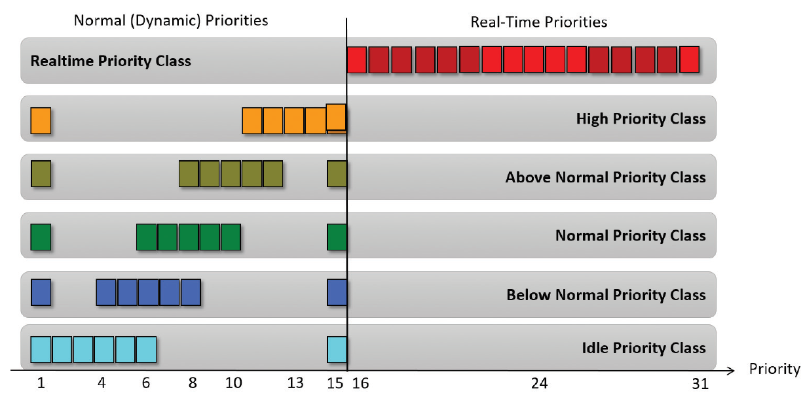
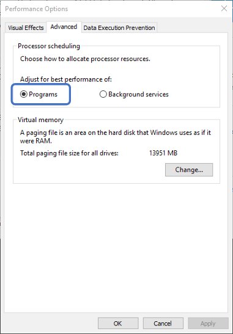

# Подсистема Windows [идёт адаптация курса по многопоточке CLRium #6]
## Потоки и планирование потоков

Что такое поток? Давайте дадим краткое определение. По своей сути поток это:
  * Средство параллельного, с другими потоками, исполнения кода
  * Имеющего общий доступ ко всем ресурсам процесса

Очень часто часто слышишь такое мнение, что потоки в .NET — они какие-то абсолютно свои. И наши .NET потоки являются чем-то более облегчённым чем есть в Windows. Но на самом деле потоки в .NET являются самыми обычными потоками Windows (хоть Windows thread id и скрыто так, что сложно достать).

Давайте посмотрим из чего они состоят и как они рождаются. По сути поток — это средство эмуляции параллельного исполнения относительно других потоков. Почему эмуляция? Потому, что поток как бы странно и смело это ни звучало — это чисто программная вещь, которая идёт из операционной системы. А операционная система создаёт этот слой эмуляции для нас. Процессор при этом о потоках ничего не знает вообще. 

Задача процессора — просто исполнять код. Поэтому с точки зрения процессора есть только один поток: последовательное исполнение команд. А задача операционной системы каким-либо образом менять поток т.о. чтобы эмулировать несколько потоков.

 # Поток в физическом понимании

"Но как же так?", - скажите вы, - "во многих магазинах и на различных сайтах я вижу запись "Intel Xeon 8 ядер 16 потоков".  Говоря по-правде это - либо скудность в терминологии либо - чисто маркетинговый ход. На самом деле внутри одного большого процессора есть в данном случае 8 ядер и каждое ядро состоит из двух логических процессоров. Такое доступно при наличии в процессоре технологии Hyper-Threading, когда каждое ядро эмулирует поведение двух процессоров (но не потоков). Делается это для повышения производительности, да. Но только для тех случаев, когда программист в курсе на каких ядрах работают его потоки. 

Технология эта - достаточно спорная: если вы работаете на двух таких псевдо-ядрах (**логических процессорах**, которые эмулируются технологие Hyper-Threading), которые при этом находятся на одном *физическом* ядре и работают с одной и той-же памятью, то вы будете постоянно попадать в ситуацию, когда второй логический процессор так же пытается обратиться к данной памяти, создавая блокировку либо попадая в блокировку, т.к. поток, находящийся на первом ядре работает с той же памятью. 

Возникает блокировка совместного доступа: хоть и идёт эмулция двух ядер, на самом-то деле оно одно. Поэтому в наихудшем сценарии эти потоки исполняются по очереди, а не параллельно.

Так если процессор ничего не знает о потоках, как же достигается параллельное исполнение потоков на каждом из его ядер? Как было сказано, поток - средство операционной системы выполнять на одном процессоре несколько задач одновременно. Достигается параллелизм очень быстрым переключением между потоками в течение очень короткого промежутка времени. Последовательно запуская на выполнение код каждого из потоков и делая это достаточно часто, операционная система достигает цели: делает их исполнение псевдопараллельным, но параллельным с точки зрения восприятия человека. 

 # Создание потоков

Простейшия функция создания потоков в пользовательском режиме операционной системы - `CreateThread`. Эта функция создаёт поток в текущем процессе. Вариантов параметризации `CreateThread` очень много и когда мы вызываем `new Thread()`, то из нашего .NET кода вызывается данная функция операционной системы.

В эту функцию передаются следующие атрибуты:

  1) **Необязательная структура с атрибутами безопасности**:
      - Дескриптор безопасности (SECURITY_ATTRIBUTES);
      - Признак наследуемости дескриптора. 
      > В .NET его нет, но можно создать поток через вызов функции операционной системы;
  2) **Необязательный размер стека**:
      - Начальный размер стека, в байтах
      - Система округляет это значение до размера страницы памяти
      > Т.к. за нас размер стека передаёт .NET, нам это делать не нужно. Это необходимо для вызовов методов и поддержки памяти.
  3) Указатель на функцию - точка входа нового потоками
  4) Необязательный аргумент для передачи данных функции потока.

Из того, что мы **не** имеем в .NET явно - это структура безопасности с атрибутами безопасности и размер стэка. Размер стэка нас мало интересует, но атрибуты безопасности нас могут заинтересовать, т.к. сталкиваемся мы с ними впервые.

Если мы создаём любым способом: из .NET или же вручную, средствами ОС, мы как итог имеем и ManageThreadId и экземпляр класса Thread. 

> *А для случая создания потока Windows вручную и в рамках этого потока исполнять наш .NET код, то, например, GetCurrentThread не вернёт .NET Thread. То есть не будет создана обёртка .NET для этого потока.*
> На самом деле это не так: .NET оборачивает его экземпляром класса Thread при первом обращении.

Также есть необязательный флаг:
    * CREATE_SUSPENDED - поток после создания не стартует. Для .NET это поведение по умолчанию.

Помимо всего прочего существует дополнительный метод `CreateRemoteThread`, который создаёт поток в чужом процессе. Он часто используется для мониторинга состояния чужого прцесса (например программа Snoop). Этот метод создаёт в другом процессе поток и там наш поток начинает исполнение. Приложения .NET так же могут заливать свои потоки в чужие процессы, однако тут могут возникнуть проблемы. Первая и самая главная - это отсутствие в целевом потоке .NET runtime. Это значит, что ни одного метод фреймворка там не будет: только WinAPI и то, что вы написали сами. Однако, если там .NET есть, то возникает вторая пролема (которой не было раньше). Это - версия runtime. Необходимо: понять, что там запущено (для этого необходимо импортировать не-.NET методы runtime, которые написаны на C/C++ и разобраться, с чем мы имеем дело). На основании полученной информации подрузить необходимые версии наших .NET библиотек и каким-то образом передать им управление. 

Я бы рекомендовал вам поиграться с задачкой такого рода: вжиться в код любого .NET процесса и вывести куда-либо сообщение об удаче внедрения (например, в файл лога)

## Планирование потоков
 
Для того чтобы понимать, в каком порядке исполнять код различных потоков, необходима организация планирования тих потоков. Ведь система может иметь как одно ядро, так и несколько. Как иметь эмуляцию двух ядер на одном так и не иметь такой эмуляции. На каждом из ядер: железных или же эмулированных необходимо исполнять как один поток, так и несколько. В конце концов система может рабтать в режиме виртуализации: в облаке, в виртуальной машине, песочнице в рамках другой операционной системы. Поэтому мы в обязательном порядке рассмотрим планирование потоков Windows. Это - настолько важная часть материала по многопоточке, что без его понимания многопоточка не встанет на своё место в нашей голове никоим образом.

Итак, начнём. Организация планирования в операционной системе Windows является: приоритетной и вытесняющей. Почему так? Потому что у каждого потока есть свой приоритет и операционная система планирует к исполнению более приоритетые потоки. А вытесняющей потому, что если возникает более приоритетный поток, он вытесняет тот, который сейчас исполнялся. Однако во многих случаях это бы означало, что часть потоков никогда не доберется до исполнения. Поэтому в операционной системе есть много механик, позволяющих потокам, которым необходимо время на исполнение его получить несмотря на свой более низкий по сравнению с остальными, приоритет.

### Уровни приоритета

Windows имеет 32 уровня приоритета (0-31)
  * 1 уровень (00 - 00) - это Zero Page Thread;
  * 15 уровней (01 - 15) - обычные динамические приоритеты;
  * 16 уровней (16 - 31) - реального времени.

Самый низкий приоритет имеет Zero Page Thread. Это - специальный поток операционной системы, который обнуляет страницы оперативной памяти, вычищая тем самым данные, которые там находились, но более не нужны, т.к. страница была освобождена. Необходимо это по одной простой причине: когда приложение освобождает память, оно может ненароком отдать кому-то чувствительные данные. Личные даные, пароли, что-то ещё. Поэтому как операционаая система так и runtime языков программирования (а у нас - .NET CLR) обнуляют получаемые участки памяти. Если операционная система понимает, что заняться особо нечем: потоки либо стоят в блокировке в ожидании чего-либо либо нет потоков, которые исполняются, то она запускает самый низкоприоритетный поток: поток обнуления памяти. Если она не доберется этим потоком до каких-либо участков, не страшно: их обнулят по требованию. Когда их запросят. Но если есть время, почему бы это не сделать заранее?  

Продолжая говорить о том, что к нам не относится, стоит отметитиь приоритыты реального времени, которые когда-то давным-давно таковыми являлись, но быстро потеряли свой статус приоритетов реального времени и от этого статуса осталось лишь название. Другими словами, Real Time приоритеты на самом деле не являются таковыми. Они являются приоритетами с исключительно высоким значнием приоритета. Т.е. если операционная система будет по какой-то причине повышать приоритет потока с приоритетом из динамической группы (об этом - позже, но, например, потому, что потоку освободили блокировку) и при этом значение до повышения было равно `15`, то повысить приоритет операционная система не сможет: следующее значение равно `16`, а оно - из диапазона реального времени. Туда повышать такими вот "твиками" нельзя. 

## Уровень приоритетов **процессов** с позиции Windows API. 

Приоритеты - штука относительная. И чтобы нам всем было проще в них ориентироваться, были введены некие правила относитености расчетов: во-первых все потоки вообще (от всех приложений) равны для планировщика: планировщик не различает потоки это различных приложений или же одного и того же приложения. Далее, когда программист пишет свою программу, он задаёт приоритет для различных потоков, создавая тем самым модель многопоточности внутри своего приложния. Он прекрасно значет, почему там был выбран пониженный приоритет, а тут - обычный. Внутри приложения всё настроено. Далее, поскольку есть пользователь системы, он также может выстраивать приоритеты для приложений, которые запускаются наэтой системе. Например, он может выбрать повышенный приоритет для какого-то расчетного сервиса, отдавая ему тем самым максимум ресурсов. Т.е. уровень приоритета можно задать и у процесса.

Однако, изменение уровня приоритета процесса не меняет *относительных приоритетов* внутри приложения: их значения сдвигаются, но не меняется внутренняя модель приоритетов: внутри по-прежнему будет поток с пониженным приоритетом и поток - с обычным. Так, как этого хотел разработчик приложения. Как же это работает? 

Существует 6 *классов приоритетов* процессов. Класс приоритетов процессов - это то, относительно чего будут создаваться приоритеты потоков. Все эти классы приоритетов можно увидеть в "Диспетчере задач", при изменении приоритета какого-либо процесса.

|    Название     | Класс  | Базовый приоритет  |
|-----------------|--------|--------------------|
| 1. Real Time    |   4    |    24              |
| 2. High         |   3    |    13              |
| 3. Above Normal |   6    |    10              |
| 4. Normal       |   2    |    8               |
| 5. Below Normal |   5    |    6               |
| 6. Idle         |   1    |    4               |

Другими словами класс приоритета - это то, относительно чего будут задаваться приоритеты потоков внутри приложения. Чтобы задать точку отсчёта, было введено понятие *базового приоритета*. Базовый приоритет - это то **значение**, чем будет являться приоритет потока с типом приоритета **Normal**:

  - Если процесс создаётся с *классом Normal* и внутри этого процесса создаётся поток с *приоритетом Normal*, то его **реальный приоритет Normal будет равен 8** (строка №4 в таблице);
  - Если Вы создаёте процесс и у него *класс приоритета Above Normal*, то *базовый приоритет* будет равен 10. Это значит, что потоки внутри этого процесса будут создаваться с более повышенным приоритетом: **Normal будет равен 10**.

Для чего это необходимо? Вы как программисты знаете модель многопоточности, которая у вас присутствует. 
Потоков может быть много и вы решаете, что один поток должен быть фоновым, так как он производит вычисления и вам
не столь важно, когда данные станут доступны: важно чтобы поток завершил вычисления (например поток обхода и анализа дерева). Поэтому, вы устанавливаете пониженный приоритет данного потока. Аналогично может сложится ситуация когда необходимо запустить поток с повышенным приоритетом.

Представим, что ваше приложение запускает пользователь и он решает, что ваше приложение потребляет слишком много процессорных ресурсов. Пользователь считает, что ваше приложение не столь важное в системе, как какие-нибудь другие приложения и понижает приоритет вашего приложения до Below Normal. Это означает, что он задаёт базовый приоритет 6 относительно которого будут рассчитываться приоритеты потоков внутри вашего приложения. Но в системе общий приоритет упадёт. Как при этом меняются приоритеты потоков внутри приложения? 
	
|                     | Уровни насыщения  |
|---------------------|-------------------|
|   1. Time Critical  |	(+15)             |
|   2. Higest         |	(+2)              |
|   3. Above normal   |	(+1)              |
|   4. Normal         |	(+0)              |
|   5. Below normal   |	(-1)              |
|   6. Lowest         |	(-2)              |
|   7. Idle	          |	(-15)             |
*Таблица 3*

Normal остаётся на уровне +0 относительно уровня базового приоритета процесса. Below normal - это (-1) относительно уровня базового. Т.е. в нашем примере с понижением уровня приоритета процесса до класса `Below Normal` приоритет потока 'Below Normal' пересчитается и будет не `8 - 1 = 7` (каким он был при классе `Normal`), а  `6 - 1 = 5`.  Lowest (-2) станет равным `4`.

`Idle` и `Time Critical` - это уровни насыщения (-15 и +15). Почему Normal - это `0` и относительно него всего два шага: -2, -1, +1 и +2? Легко провести параллель с обучением. Мы ходим в школу, получаем оценки наших знаний (5,4,3,2,1) и нам понятно, что это за оценки: 5 - молодец, 4 - хорошо, 3 - вообще не постарался, 2 - это не делал ни чего, а 1 - это то, что можно исправить потом на 4. Но если у нас вводится 10-ти бальная система оценок (или что вообще ужас - 100-бальная), то возникает неясность: что такое 9 баллов или 7? Как понять, что вам поставили 3 или 4? 

Тоже самое и с приоритетами. У нас есть Normal. Дальше, относительно Normal у нас есть чуть повыше 
Normal (Normal above), чуть пониже Normal (Normal below). Также есть шаг на два вверх 
или на два вниз (Higest и Lowest). Нам, поверьте, нет никакой необходимости в более подробной градации. Единственное, очень редко, может раз в жизни, нам понадобится сказать: выше чем любой приоритет в системе. Тогда мы выставляем уровень `Time Critical`. Либо наоборот: это надо делать, когда во всей системе делать нечего. Тогда мы выставлем уровень `Idle`. Это значения - так называемые уровни насыщения.

## Как рассчитываются уровни приоритета?

  1. Берётся класс приоритета процесса
  2. Класс преобразуется в базовый приоритет
  3. Уровень потока = Установленный уровень + Базовый приоритет процесса

У нас бал класс приоритета процесса Normal (Таблица 3) и приоритет потоков Normal - это 8. Если процесс Above Normal то поток Normal получается равен 9. Если же процесс выставлен в Higest, то поток Normal получается равен 10.

Поскольку для планировщика потоков Windows все потоки процессов равнозначны, то:
  * Для процесса класса Normal и потока Above-Normal 
  * Для процесса класса Higest и потока Normal
  конечные приоритеты будут одинаковыми и равны 10.

Если мы имеем два процесса: один с приоритетом Normal, а второй - с приоритетом Higest, но при этом
первый имел поток Higest а второй Normal, то система их приоритеты будет рассматривать как одинаковые.

Как уже обсуждалось, группа приоритетов Real-Time на самом деле не является таковой, поскольку настоящий Real-Time - это гарантированная доставка сообщения за определённое время либо обработка его получения. Т.е., другими словами, если на конкретном ядре есть такой поток, других там быть не должно. Однако это ведь не так: система может решить, что низкоприоритетный поток давно не работал и дать ему время, отключив real-time. Вернее его назвать классом приоритетов который работает над обычными приоритетами и куда обычные приоритеты не могут уйти, попав под ситуации, когда Windows временоо повышает им приоритет.

Но так как поток повышенным приоритетом исполняется только один на группе ядер, то получается,
что если у вас даже Real-Time потоки, не факт, что им будет выделено время.

| Класс приоритета / относительный приоритет | Real-Time | High | Above-Normal | Normal | Below-Normal | Idle |
|--------------------------------------------|-----------|------|--------------|--------|--------------|------|
| Time Critical (+насыщение)                 |     31    |  15  |      15      |   15   |       15     |  15  |
| Highest (+2)                               |     26    |  15  |      12      |   10   |       8      |   6  |
| Above Normal (+1)                          |     25    |  14  |      11      |    9   |       7      |   5  |
| Normal (0)                                 |     24    |  13  |      10      |    8   |       6      |   4  |
| Below Normal (-1)                          |     23    |  12  |       9      |    7   |       5      |   3  |
| Lowest (-2)                                |     22    |  11  |       8      |    6   |       4      |   2  |
| Idle (-насыщение)                          |     16    |   1  |       1      |    1   |       1      |   1  |

Если перевести в графический вид, то можно заметить, что классы приоритетов пересекаются. Например, существует пересечение Above-Normal Normal Below-Normal (столбик с квадратиками):

Это значит, что для этих трех классов приоритетов процессов существуют такие приоритеты потоков внутри этих классов, что реальный приоритет будет равен. При жтом, когда вы задаёте приоритет процессу вы просто повышаете или понижаете все его внутринние приоритеты потоков на определённое значение (см. Таблица 3).

Поэтому, когда процессу выдаётся более высокий класс приоритета, это повышает приоритет потоков процесса 
отностельно обычных – с классом Normal.

| Класс приоритета / относительный приоритет | Real-Time | High | Above-Normal | Normal | Below-Normal | Idle |
|--------------------------------------------|-----------|------|--------------|--------|--------------|------|
| Time Critical (+насыщение)                 |     31    |  15  |      15      |   15   |       15     |  15  |
| Highest (+2)                               |     26    |  15  |      12      |   10   |       8      |   6  |
| Above Normal (+1)                          |     25    |  14  |      11      |    9   |       7      |   5  |
| Normal (0)                                 |     24    |  13  |      10      |    8   |       6      |   4  |
| Below Normal (-1)                          |     23    |  12  |       9      |    7   |       5      |   3  |
| Lowest (-2)                                |     22    |  11  |       8      |    6   |       4      |   2  |
| Idle (-насыщение)                          |     16    |   1  |       1      |    1   |       1      |   1  |

## Состояние потока

Поток в терминологии планирования может находиться в нескольких состояниях, образуя конечный автомат, в рамках которого работает поток. Когда создаётся поток, он создаётся в статусе *Initialized*. Т.е. он проинициализирован и готов к работе. Далее, когда пользовательский код стартует поток, тот переводится в статус *Ready*. Т.е. готовности к исполнению. Другими словами, поток готов к тому, что его в любой момент начнут исполнять на каком-либо процессорном ядре. Спустя некоторое время планировщик просыпается чтобы выбрать следующий к исполнению на текущем процессорном ядре поток (для каждого ядра создается свой планировщик). Для этого он рукодоствуется рядом правил: некоторым потокам он временно повышает приоритет (поговорим об этом чуть позже), некоторые находятся в блокировке и поэтому не участвуют в планировании. В любом случае после всех манипуляций он начинает выбирать поток, на который будет переключено текущее процессорное ядро из списка готовых к исполнению. Т.е. тех, кто в своей машине состояний находится в состоянии *Ready*.

Когда планировщик выбрал поток, он снимает его из очереди потоков со статусом *Ready* и переводит его в состояние *Standby* - некоторое промежуточное состояние. После этого планировщик должен заменить активный поток на текущем ядре. Для этого он устанавливает состояние регистров процессора в то, каким оно было когда-то на момент прерывания планировщиком. Тем самым процессор переносится в то расчётное состояние, каким оно было на момент прерывания планирощиком и если при этом вернуться на ту инструкцию, с которой когда-то программа была прервана и тем самым мы запустим поток на исполнение. Но перед таем как окончательно запустить исполнение потока, планировщик изменяет его статус в состояние исполнения **Running**. 

Каждому потоку даётся накоторый промежуток времени, в течении которого он может исполняться прежде чем его прервут чтобы отдать время другому. Этот промежуток называется *квантом*. Именно благодаря дроблению времени на кванты и благодаря тому, что все потоки исполняются друг за другом (но понемногу) и возникает иллюзия параллельности исполнения программ. Да, на различных ядрах код исполняется истинно параллельно. Но в рамках одного ядра - нет. Именно поэтому если ядер у процессора много, код на ни работает быстрее.

Когда же поток отрабатывает свой квант времени, планировщик его переводит в состояние *Ready* или *Waiting*. 
В состояние *Waiting* поток входит в том случае, если он входит блокировку (блокировки уровня ядра: mutex, semaphore, работа с дисковой системой ввода/вывода и т.п.). Когда поток находится в состоянии Waiting, процессор вообще не тратит время на данный поток т.к. он исчезает из планирования: в планировании участвуют только те потоки, которые к этому готовы. Т.е. находятся в состоянии *Ready*. После снятия блокировки поток переводится в состояние Ready и после того, как до него доходит очередь он начинает выполняться. Существует дополнительное состояние *Transition*, но мы его рассматривать не будем. И последнее состояние: *Terminated* - это когда жизнь потока завершена.

За каждым ядром операционная система закрепляет свой планировщик потоков (на котором "крутится" несколько потоков). Допустим у нас исполняется 50 потоков **на одном ядре**. Квант, выделяемый одному потоку около 20 мcек в лучшем случае. Это значит, что каждый поток получит время на исполнение примерно 1 раз в `50 * 20 = 1000 мсек`. **Т.е. один раз в секунду на 20 мcек**. Таким образом, если вы созадите большое количество процессов, в каждом из которых будет как минимум 1 активный поток, который не заблокирован ожиданием ввода или вывода, то вы тем самым не просто делите общее время между всеми участниками, но и оттягиваете следующий момент включения потока в работу.

Двайте обобщим.

Состояния потоков:

  * Initialized. Используется при создании потока
  * Ready. Готов. Состояние готовности, ожидание выполнения
    * При поиске следующего потока планировщик рассматривает только это состояние
  * Deferred Ready. Готовность с отложенным выполнением.
    * Поток выбран на исполнение на выбранном процессоре, но ещё не запущен.
    * Для минимизации блокировки БД планирования
  * Standby. В повышенной готовности.
    * Был выбран следующим для исполнения на конкретном процессоре
    * Всё ещё может быть вытеснен более приоритетным потоком
  * Running. Выполнение
    * Исполняется до истечения кванта времени
  * Waiting
    * Ожидание объекта синхронизации
    * ОС ждёт чего-либо от имени потока
  * Transition
    * Если готов к выполнению, но стек ядра выгружен из памяти
  * Terminated. Завершён

Рисунок 2: Состояние потоков

`тут обработано`
-----
`тут пока НЕ обработано`

На рисунке 2 изображено отношения потоков и процессора. Откуда видно, что потоки к процессору не имеют ни какого отношкния. Для планировщика потоков все они равноценны.

Как это всё работает? Допустим мы имеем три процесса 1, 2 и 4. 
Есть две группы ядер со своим планировщиком потоков. 
Есть очереди потоков по приоритетам. И когда поток планируется в работу, переходит в состояние Ready, 
это означает, что он встаёт в определённую очередь. Если это поток с приоритетом Normal, запущенный внутри приложения
с Классом Normal будет иметь 8. Значит когда он исполнится то из Running он перейдёт в Ready и будет поставлен в очередь 8.
Если есть потоки которые так-же находятся в состоянии Ready, но более высоких приоритетов, то планировщик в будет выполнять их
в первую очередь и не будет доходить до вашего потока, пока все потоки с более высоким приоритетом не будут исполнены.

Рисунок 2: Потоки и процессор

## Кванты времени

Квант - это промежуток времени в течение которого поток будет исполняться. Каждому потоку выделяется квант времени на исполнение. Потоки работают через и в течение определённого количество времени. Между потоками есть промежутки времени, во время которых планировщик потоков выполняет свою работу.

На однопроцессорной системе x86 работа ситемного таймера настроена на срабатывает каждые 10 млСек, тем самым возникает аппаратное прерывание процессора INT 08 и вызов функции пользователя. На этом прерывании установлен планировщик. На многопроцессорной системе таймер настроен на 15 млСек.  

Рисунок 3: Потоки и процессор

Исходя из системного таймера возникает **квантовая единица** (рис. 4) равная 1/3 этого интервала.
Далее когда меняется поток это значение называется **Значение Перезапуска Кванта**. Оно различно на разных 
операционных системах. На клиентских системах Windows оно равно 6. Это значит, что количество квантовых единиц,
выделяемых потоку, равно 6. Должно пройти два такта ситемного таймера 20 мл.сек. на однопроцессорной системе 
и 30 мл.сек. на многопроцессорной системе (см. рис. 4) и произойдёт переход к другому потоку.

Рисунок 4: Квантовая единица

 + Квантовая Цель = \[Фактич. Квантовые Единицы\] \* \[Тактовых Импульсов на квант времени\]

Временная шкала системного таймера представлена на рисунке 5. Значение перезапуска кванта в клиентских системах Windows
равно 6 в серверных системах Windows 36, то есть в шесть раз длиннее значит поток будет отрабатывать 120 мл.сек. 
После чего он перейдёт в состояние Ready и вернётся к исполнению не скоро. Поэтому на серверной системе необходимо 
оставлять только те приложения, которые там должны работать и больше ничего лишнего.

Рисунок 5: Временная шкала системного таймера

 + Значение Перезапуска Кванта = \[Фактич. Квантовые Единицы\] \* \[Кол-во Квант. Единиц в Такте\]
   * = 6 (2 \* 3 ) в клиентских системах Windows
   * = 36 (12 \* 3) в серверных системах Windows

Предположим что один из потоков на уровне второй квантовой единицы встал в блокировку (рис. 6). Этот поток теряет
квантовое время и оно отдаётся другому потоку. Другой поток начал свою работу. Но поскольку планировщик запускается только
когда срабатывает системный таймер, то следующий поток отработает дольше. Следующий поток отработает положенное время.
Получается так, что если вы работаете с блокировками, то ваше приложение будет выполняться малое количество времени. 
Во время работы потока могут возникнуть аппаратные прерывания (INT). 
Прерывания это отвлечение процессора от выполнения текущего потока для выполнения более важных задач 
(получение состояния внешних устройств и т.п.). Обработка прерывания занимает время потока, но вас это не должно беспокоить
потому, что время затраченное на обработку прерывания не учитывается в планировании и соответственно ваш поток 
отработает дольше.
Далее, когда поток, освобождённый от блокировки, просыпается, то он дорабатывает своё значение квантового перезапуска.
 
 

Рисунок 6: Работа потока

Давайте определим количество квантовых циклов на квант. Согласно следующих шагов.

Шаги нахождение квантовых циклов на квант:

  * Возьмём тактовую частоту процессора:
    * Выполним команду поцессора <b>сpuid</b>, которая выдаст точное значение частоты нашего процессора в ГГц : GenuineIntel 2601 fffffff00000000 …
  * Переведём её в герцы:
    * var freq = 2601 \* 1,000,000,000 = 2 601 000 000 тактов/сек
  * При помощи утилиты <b>clockres</b> от Sysinternals получаем значение интервала таймера в системе (как часто срабатывает таймер):
    * 15,625 мсек - то есть у нас многопроцессорная система ( 10 мсек - однопроцессорная )
  * Преобразуем его в секунды: 
    * 15,625 мсек / 1000 = 0,015625 сек
  * Умножим на кол-во циклов в секунду и получим число тактов на интервал таймера (от "тика" до "тика" системного таймера):
    * 2,601,000,000 тактов/сек  \* 0,015625 сек = 32 837 625 тактов
  * Получим число тактов на квантовую единицу (квантовая единица это 1/3 системного таймера):
    * 32,837,625 / 3 = 10,945,875 тактов или 0x00A70553
  * Если вывести дамп переменной KiCyclesPerClockQuantum, получится схожее значение:
    * lkd> dd nt!KiCyclesPerClockQuantum L1
    * 8149755c 00a70550

Относительно <b>квантовой единицы</b> рассчитывается цель. Эта переменная присутствует в системе, но её можно получить только
под отладчиком уровня ядра. Рассчитанное нами значение практически совпадает со значением в системе ( 0x00A70550 ~= 0x00A70553).
Итоговые данные для нашего случая представлены в  таблице 5. Она отображает какое количество тактов исполнится в нашем процессе ,
прежде чем он потеряет управление.

Это важно с нескольких позиций.
  1. Если есть серверное приложение и у нас очень много потоков, и они не очень хорошо организованы, то одни потоки будут 
  "страдать" из-за других, если они работают на одном ядре.
  2. Можно попытаться присвоить потоки каким-то ядрам и тем самым обеспечить им более долгую работу.
  3. Передача процессорного времени другим потокам в случае блокировки
  
| Система    | Знач. Перезапуска Кванта | Квантовая Цель (тактов) |
|------------|--------------------------|-------------------------|
| Клиентская |           6              |       65 675 250        |
| Серверная  |          36              |      394 051 500        |

### Управление величиной кванта

Заходим в свойства своего компьютера. Далее "Change Settings"

Переходим в Perfimance -> Settings

Переходим на вкладку Advanced. Programs - это короткие кванты (6). Почему для Desktop у нас выбрано 6?
Потому-что, у нас необходима отзывчивость системы, так как за компьютером работае пользователь.
Педположим в Chrome открыто 50 вкладок. Если у нас будет установлен квант равный 36 (сервер), то даже перемещение
курсора "мыши" по экрану будет притормаживать из-за того что потоку GUI будет выделяться мало времени.

Оптимизация под программы
  * Использование коротких, переменных квантов
  * Режим по-умолчанию для клиентских Windows, включая XBOX, Hololens 
  * Можно выбрать настройку, если серверная ОС установлена как настольная

Оптимизация под фоновые службы
  * Использование длинных, фиксированных квантов
  * Режим по-умолчанию для серверных Windows
  * Можно выбрать настройку, если настольная ОС установлена как серверная
  * Поскольку эффект немедленный, можно выставить настройку перед началом расчётов, а после расчётов (например, утром) – вернуть настройки назад  

### Переменные кванты

Кванты времени бывают не только статичные но и переменные. Статичные кванты это когда в имеете 6 и 36 не зависимо от условий (каких условий?).
Переменные кванты в зависимости от условий вам может быть выделено больше процессорного времени на квант.
В это условия входит, например, приложение которое сейчас находится на переднем плане - оно работает дольше, чем все остальные.
И, соответственно, быстрее.
При копировании файлов, если перемещать курсор "мыши" над окном, то копирование идёт быстрее :) из-за того, 
что такие потоки получают временно повышение приоритета.

Если разрешено использование переменных квантов (клиентская ОС):
  * в таблицу переменных квантов загружается PspForegroundQuantum, которая используется функцией PspComputeQuantum, загружается таблица PspVariableQuantums
  * Алгоритм подбирает подходящий индекс кванта в зависимости от того, работает процесс на переднем плане или нет:
    * есть ли в нём поток, владеющий окном переднего плана или нет?
  * В паре с планировщиком потоков, это даёт повышение приоритета для этого процесса.

Запущено два калькулятора: правый - активный (на переднем плане), левый - фоновый. 
Есть группы квантов: переменные и фиксированные.
И в таблице 6 показаны индексы этих калькуляторов. Правый будет иметь индекс 12 или 18, левый - 6.
На пользовательской Windows установлено по умолчанию переменное значение кванта.
На сервере, по умолчанию, нет переменных квантов.

| Значение      | Индекс короткого кванта | Индекс длинного кванта |
|---------------|-------------------------|------------------------|
| Переменное    |   6      12      18     |   12     24     36     |
| Фиксированное |  18      18      18     |   36     36     36     |

Настройка меняется в реестре.
Можно поменять систему раздачи квантов по адресу HKLM\SYSTEM\CurrentControlSet\PriorityControl.

|   4                  |        3 \| 2            |       1 \| 0       |
|----------------------|--------------------------|--------------------|
| короткие или длинные | Переменные/фиксированные | Разнос приоритетов |

Параметр побитово делится на три зоны. 
Короткие или длинные
 + 0 или 3 – короткие для клиенских, длинные для серверных
 + 1 – длинные кванты
 + 2 – короткие кванты

Переменные или фиксированные
 + 0 или 3 – переменные для клиенских, фиксированные для серверных
 + 1 – переменные кванты

Разнос приоритетов
 + 0 - 2 – определяет приоритетное разделение

# Выводы

 1. Когда поток входит в блокировку, он перестаёт учавствовать в планировании.
 2. На однопроцессорной системе планировщик всегда забирает поток сверху, поэтому он и называется во первых, с приоритетами,
 во вторых он вытесняющий. Если появляется поток с более высоким приоритетом, то планировщик вытесняет исполняемый поток 
 и переключается на поток с большим приоритетом.
 3. Важно знать, что есть кванты. Квант - это достаточно длинная по времени процедура. И независимо от того, 
 прерывается ли ваш поток, время, которое выделено потоку, он отработает
 4. Если поток переходит в блокировку, то часть времени переходит другому потоку
